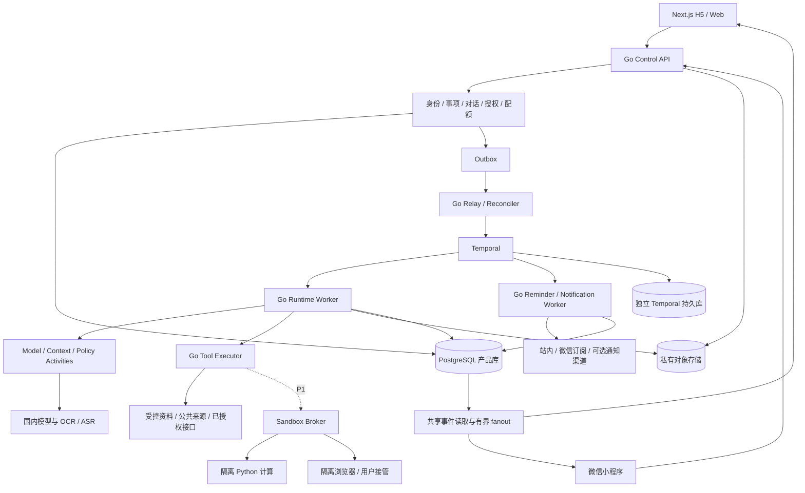
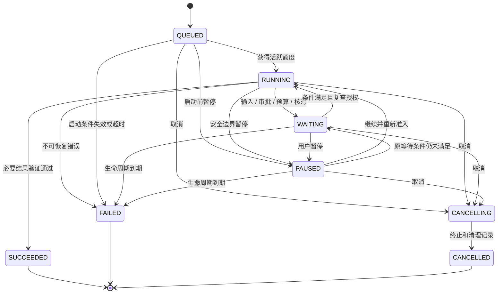
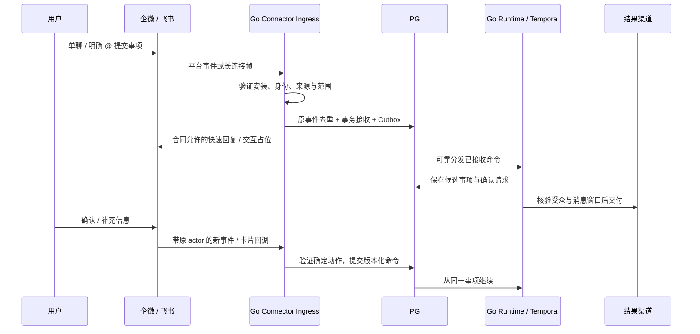

# 国内生活助理 Agent Cloud Runtime 技术架构

版本：v0.8 · 日期：2026-10-05 · 状态：目标架构；代码实际交付与验证见 [实施状态](./IMPLEMENTATION.md)，未交付能力见 [完整目标跟踪](./GOAL_AUDIT.md)。

v0.8 的资料层已实现：API 流式上传，独立 file-parser 提取被动文档，schema v9 保存元数据与聊天绑定，AES-256-GCM 加密本地/S3 对象，Agent 分页读取和精确统计，成果持久保存后内部预览与下载。公共网页工具使用受控 Go HTTP 与 Readability；不是云端浏览器。详细限制、对象提交不确定时的处理和解析隔离边界见 [资料合同](./FILES.md)。

配套见 [PRD](./PRD.md)、[dots 功能对标调研](./DOTS_BENCHMARK.md) 和 [使用场景与办公接入调研](./SCENARIO_RESEARCH.md)。原 FastAPI 方案保留于 [v0.1 存档](./archive/v0.1/ARCHITECTURE.md)。本文的接口、表和流程是本项目设计合同，不是 OpenAI dots 内部实现或已经运行的代码。

## 1. 推荐技术栈与选择边界

采用 **Next.js 移动 H5 / Web + 独立微信小程序 + Go 模块化单体 API + Go Durable Runtime / Worker + Temporal + PostgreSQL + 中国大陆对象存储**。对象存储通过 S3 合同或供应商 Adapter 接入；兼容性须实际测试。P1 的 Python 数据计算和 Node / Playwright 浏览器工具运行于隔离执行池。

Go 负责任务生命周期、模型请求、上下文、权限、预算、连接器和交付。Python 只执行被授予的计算 Activity，不再维护另一套主 Agent Loop；首版不需要 FastAPI 作为主 API。

| 决策 | 选择 | 原因与代价 |
| --- | --- | --- |
| 业务组织 | 一个 Go 代码库、模块化单体、多个部署入口 | 同事务处理授权与账本；按信任边界拆进程，不按每项功能拆服务 |
| HTTP / DB | Go net/http、pgx、显式 SQL / Repository | 合同清晰；路由和 SQL 生成工具可在实现时选定 |
| Durable 编排 | Temporal Go SDK | 复用等待、计时、重放、消息和调度；承担学习与运维成本 |
| 状态真相 | Temporal 控制执行；PG 保存业务事实和授权 | PG 不再独立推进第二套执行 FSM |
| 模型 | 平台默认 + 个人 BYOK 国内模型 | 首页管理密钥；任务捕获不可变配置；具体型号须授权并验证 |
| 事件 | PG 持久事件 + 进程内有界 fanout | HTTP 命令、Web SSE；微信端单独验证传输能力 |
| 记忆 | PG 结构化偏好、摘要、全文检索 | 可查看和删除；检索质量不足再加 pgvector |
| 提醒 | 独立确定性 Workflow 与通知队列 | 到点不调用模型，不受推理任务拥堵和模型额度影响 |
| 云端电脑 | P1 按需隔离会话、文件和加密浏览器状态 | 需要资源隔离与接管治理，不承诺每人永久一台 VM |

首版不增加 Redis 任务队列、Kafka、NATS、Kubernetes 或图数据库。缓存或独立事件网关须由实际瓶颈推动。Temporal 本身需要服务和持久库，Go 不会消除它的运维费用。

Go 适合并发服务的工程组织，但没有同条件压测，不能宣称固定性能倍数。[Go 并发说明](https://go.dev/doc/effective_go#concurrency) 模型推理和网站操作通常是独立耗时项，切换语言不能直接缩短供应商生成时间。性能方法见第 17 节。

## 2. 逻辑架构与部署



Gateway、Policy、Budget 和 Memory 是 Go 模块，不是单独微服务。Model Gateway 无工具执行凭据；Executor 不可任意改写 Runtime 状态；通知 Worker 只处理已保存的个人提醒与批准通知。

| 进程 / 设施 | P0 职责 | 部署约束 |
| --- | --- | --- |
| Next.js | 移动对话、事项卡、文件预览与 Web 界面 | 不保管模型密钥；长任务不放服务端页面请求 |
| 微信小程序 | 语音输入、截图、日常查看、确认与通知授权 | 独立客户端，共享 API 合同，不能直接运行 Next.js 页面代码 |
| control-api | 身份、查询、命令、上传授权、事件流 | 短请求；不在 HTTP handler 跑 Agent Loop |
| runtime-worker | Go Workflow、模型与上下文 Activities | Workflow 与 Activity 的依赖和并发分别限制 |
| executor-worker | 受控读取、文件处理、确定写入 | 最小凭据、受限出站、大小与时间上限 |
| notification-worker | 提醒 timer、准入与发送 Activities | 独立 Task Queue 与保留资源；避免模型任务占满 |
| relay / reconciler | Outbox 投递、配置同步、未知动作核对 | 同代码库独立入口；动作核对不从头重跑任务 |
| Temporal | histories、timers、schedules、queues | 产品库和引擎库不同数据库 / 账号；部署认证 |
| PG / 对象存储 | 产品事实 / 大载荷和文件 | 私有网络、加密、备份；对象非公开桶 |
| Sandbox Broker（P1） | 分配计算与浏览器、控制权交接 | 独立执行池，与主服务机器及生产密钥隔离 |

P0 可在 Linux 单机或少量实例部署，单机是明确故障域；不发布高可用 SLA。生产接入、镜像、Go / Node / SDK / 数据库版本在实现时固定，Windows 开发使用 Git Bash 和本机 PostgreSQL / Temporal，或现有容器依赖。

## 3. 消费领域模型

### 3.1 事项、提醒、会话和 Run 分离

```text
User → PersonalSpace（内部 workspace_id，P0 一个 Owner）
         ├─ AssistantInstance（默认一位助理，引用不可变配置版本）
         ├─ Conversation → Messages（来源渠道与可见范围）
         ├─ Matter / Task（长期目标、状态、清单、revision）
         │     ├─ Trigger（后续研究 / 检查计划）
         │     ├─ Run（一次有界模型工作）→ Step → Attempt
         │     └─ Reminder（确定日期、静默、渠道、revision）
         │           └─ Occurrence → NotificationDelivery
         ├─ MemoryItem（已确认偏好与来源）
         └─ Artifact / Attachment（文件与结果）
```

Matter、偏好和提醒可以持续数月；普通模型 Run 的最长生命周期默认 7 天。保存一个三个月后的提醒不能创建一个持续推理三个月的 Run。未来日期由轻量的 Reminder Workflow 或 Schedule 保存，空闲只保留持久状态；到点启动短通知执行。

修改事项是一项版本化业务命令。模型可以建议新日期，但关键字段需按 PRD 确认；API 事务递增事项 / 提醒 revision，旧触发在实际发送前检查 revision。用户关闭聊天连接不取消工作；当前 Run 暂停、停止未来触发、删除提醒、停止事项分别实现。

### 3.2 产品表与必要约束

所有个人数据表包含 `workspace_id`；个人空间是内部隔离边界，不作为普通用户配置概念。

| 表 | 主要字段 / 约束 |
| --- | --- |
| users / external_identities / workspaces / memberships | 一个身份可绑定 Web 与微信；外部身份唯一；按 membership 鉴权 |
| assistant_versions / assistant_instances | 不可变配置、hash、memory namespace；每用户默认一实例 |
| conversations / messages | channel、visibility、matter_id、content_ref、client_message_id；客户端消息键唯一 |
| tasks / task_items | objective_ref、status、revision、completion_condition；长期状态独立于 Run |
| reminders / triggers | task_id、kind、timezone、due_time、quiet_policy、desired_revision、enabled、sync_status |
| trigger_occurrences | trigger_id、revision、nominal_time_utc、dedup_key、admission_result；唯一发生键 |
| runs / workflow_bindings | task_id、snapshot_ref、status、state_revision、wait_reason；binding 用 subject_type / subject_id 区分模型 Run、提醒 timer 与通知执行链 |
| steps / step_attempts | 稳定 step_id、attempt_no、request_id、usage、error、结果引用；逻辑与实际请求分开 |
| model_profiles / model_grants | 型号能力、region、price_version；个人空间对平台模型的获准使用范围 |
| platform_credentials / user_credentials | 管理侧密钥与个人连接密钥分域；加密内容、key version、撤销状态 |
| tool_versions / connector_connections | schema_hash、effect、policy floor、授权身份与资源范围 |
| operation_intents / approvals | 固定 action_hash、idempotency_key、状态、一次决策和有效期 |
| run_commands / outbox | command_id、目标、revision、状态、重试时间；事务内持久化 |
| task_claims / execution_slots | Task 排他与活跃并发独立；lease、generation |
| budget_accounts / reservations / usage_ledger | CNY 成本、预留 / 结算 / 未知费用，scope 与 price version |
| channel_bindings / notification_grants | 用户身份、模板范围、授权来源 / 时间、可用性、供应商错误；授权记录不是无限发送许可 |
| notification_deliveries / notification_attempts | occurrence、channel、template、safe_preview、状态、provider request / receipt；逻辑发送键唯一 |
| memory_items / source_cursors | namespace、type、provenance、revision、有效期、删除；来源去重 |
| artifacts / attachments | 对象键、hash、类型、扫描状态、生成标识、可用状态与保留策略 |
| business_events / audit_records | 个人空间事件序号、可见范围、脱敏 payload ref；动作审计最小化 |

用复合外键或等价检查限制对象跨空间关联。主要列表索引为 `(workspace_id, created_at)`，执行查询为 `(workspace_id, status, updated_at)`；事件 `(workspace_id, sequence)` 唯一；Outbox 对待处理状态和重试时间索引。

API 上传或连接对象不能由客户端自报其他用户的 workspace、openid、credential_ref 或 object_key。通知收件身份来自已验证 ChannelBinding，不接受模型自由传入手机号或 openid。

### 3.3 快照与当前权限

Run 固定助理配置、Matter revision、模型候选、工具版本、目标来源、预算和完成条件，均带 hash。快照用于解释与恢复，不冻结授权。每次真正执行的范围为：

```text
Run 启动允许范围 ∩ 当前个人空间授权 ∩ 当前来源 / 连接范围
∩ 平台最低限制 ∩ 当前撤销、取消和删除状态
```

用户收紧权限立即影响后续动作；新增广权限用于后续 Run。编辑目标时记录变更，取消未执行旧动作，重新构建下一步；不能把旧审批套到新目标。已执行副作用仍保留结果。

## 4. 状态所有权与用户控制



| 事实 | 所有者与处理 |
| --- | --- |
| 下一步、等待、timer、Activity 调度 | Temporal Workflow history；PG 不再自行推动执行 FSM |
| Run / Step 展示与结果 | 幂等业务 Activity 在 PG 提交，Reconciler 校对 |
| 授权、取消 fence、审批、资金 | PG 当前事实，Executor 提交前必须读取 |
| 消息是否发送 / 用户是否阅读 | 供应商回执与可核实证据，不能从 Workflow completed 推导 |
| Token 增量 | 临时 UI 流；最终回答和业务结果持久化 |

API 接收暂停 / 取消返回命令 ID，界面分别显示“请求中”和“已生效”。暂停 Schedule 不等于暂停在执行的 Run；取消不能撤回已经完成或在途的第三方动作。终态 Run 不重新打开，重新工作创建关联的新 Run。

长事项不因 7 天 Run 到期被删除；其模型工作显示过期，可由用户继续创建新 Run。提醒的未来计划也不依赖这个 Run 是否仍存在。

## 5. Go + Temporal 持久编排

### 5.1 Workflow 映射与确定性

| 用例 | 实现 |
| --- | --- |
| 一次模型工作 | `RunWorkflow`，绑定业务 run_id |
| 上下文 / 模型 / 策略 / 工具 / 完成 | 有幂等 ID、明确超时的 Activities |
| 用户控制与审批 | command_id 去重的 Signal / Update，随后读取 PG 当前事实 |
| 周期研究 | `ScheduledRunWorkflow` 创建业务 Run，等待 Child 完成 |
| 一次性提醒 | `ReminderWorkflow(reminder_id, revision)`，timer 后启动确定交付 |
| 周期提醒 | Schedule → 短 `NotificationWorkflow`，不运行模型 Loop |
| P1 委派 | Child Workflow + 独立业务 Run，父预算与授权交集 |

Go Workflow 不直接访问网络、数据库、对象存储、随机 ID 或真实时钟。使用 `workflow.Go / Channel / Selector / Now / Sleep` 等确定性 SDK 原语；普通 `go`、`chan`、`select` 和非确定 map 迭代不能随意进入可重放控制逻辑。[Temporal Go workflow 合同](https://pkg.go.dev/go.temporal.io/sdk/workflow)

Workflow history 只保存引用、hash、决策码和小型状态；文件、对话原文与模型响应放加密对象存储。载荷 converter、搜索属性和错误日志均不能泄漏秘密。Worker 升级使用兼容 patch / 版本路由，对实际脱敏历史 replay；不得直接部署不兼容控制流。Continue-as-New 保留业务 ID、账本引用和命令位置，不绕开步骤 / 费用上限。

### 5.2 唯一的有界 Agent Loop

以下为语言无关合同示意，不是可以运行的代码：

```text
load_snapshot_and_claim(run_id)
repeat within step / attempt / active_time / lifecycle limits:
    apply_persisted_commands()
    if waiting_or_paused:
        release_active_slot_when_requests_settled()
        await_durable_signal_or_timer()
        recheck_current_authorization()
        continue_at_same_logical_step()
    acquire_active_slot()
    context_ref = build_bounded_context_activity()
    decision = model_activity(stable_step_id, context_ref)
    if ASK_USER: persist_question_and_wait()
    if TOOL_CALL:
        intent = validate_and_persist_fixed_action()
        policy = evaluate_current_policy(intent)
        if ASK: wait_for_exact_approval()
        if ALLOW: executor_activity(intent)
        if DENY: record_denial_observation()
    if FINISH:
        validate_required_result_and_references()
        finalize_run_activity()
        exit
release_claim_on_terminal()
```

P0 多个工具按稳定顺序处理；每个逻辑模型 / 工具步骤计入上限，每次实际付费请求计入 Attempt。基础设施 Activity 有独立上限，不消耗 Agent 的逻辑 Step。等待不新增推理轮次；Python 或浏览器 Adapter 不可以再次创建无界主 Loop。P1 最多两个只读 Child Run，共享父总限额，不通过委派放大预算。

### 5.3 并发与重试

同一模型 Task 从准入到终态持有排他 claim，包含 QUEUED / WAITING / PAUSED；忙碌周期研究跳过，手动重启返回已有 Run。个人空间活跃模型额度 2，全局 5；WAITING / PAUSED 释放已结束请求的额度，恢复时重新准入。

提醒不争抢这个模型 Task claim 或模型 slot，具有独立通知队列和配额。否则出行方案等三天审批会挡住已有到期提醒。

| 请求 | 初始策略 | 不确定结果 |
| --- | --- | --- |
| 内部落库 | 退避、最多 5 次、稳定 ID | 重试读取已有结果 |
| 只读 HTTP 工具 | 请求 30 秒、最多 3 次 | 记录每次请求和计费，尊重限流 |
| 模型 | 请求 120 秒、最多 2 次实际提交 | 保留未知费用预留；回退也是新 Attempt |
| 有可靠下游幂等的写入 | 相同动作与键、有限重试 | 查询并复用原回执 |
| 无可靠幂等的通知 / 外部写入 | 实际提交默认最多 1 次 | UNKNOWN，核对前不盲目重发 |
| 无效凭据 / schema / 权限 | 不自动重试 | 等待修复或明确失败 |

SDK Activity 重试和内部 HTTP 重试只有一层负责实际请求，不能乘出多次提交。Activity 先持久化结果再返回；若已落库但 Temporal 未收到返回，重试读取原结果。Workflow Task 恢复不是重新从头付费执行。

lease 与 generation 约束本地结果提交，不能阻止已发往第三方的请求。未知写入保留锁；Reconciler 核对后释放。Temporal 不提供所有第三方操作的 exactly-once 保证。[Temporal Activities](https://docs.temporal.io/activities)

## 6. 提醒与通知交付

### 6.1 日期保存与修改

保存用户原话、消息接收时间、明确时区（默认 Asia/Shanghai）、规范时间、重要字段确认与 revision。简单已确认日期可以直接保存；相对日期 / OCR 推断不是最终事实。P0 复杂农历、节假日规则要求用户选定日期；未来发生时间用与引擎一致的日历计算预览，记录 tzdata 版本。

提醒创建事务写入提醒、发生计划、必要通知额度预留和 Outbox，状态为 PENDING_SYNC；调度同步后才为 APPLIED。一次性 timer 可长于 7 天，它不是模型 Run。修改时增 revision 并取消旧 timer；即使取消命令晚到，发送准入仍检查当前 revision / enabled / due_time。

提交前最后一次 revision 检查与进入 IN_FLIGHT 在 PG 同一受锁事务中完成。若改期先完成，旧动作不得提交；若发送已进入 IN_FLIGHT，改期显示“已有一次发送在途”，保留核对。不能承诺撤回已经交给渠道的消息。

### 6.2 通知授权合同

P0 必须有站内持久记录；微信推送是另一个可用性条件。保存提醒和微信订阅授权分开。用户点击授权时记录模板和来源；一次授权可发送一条服务通知，实际模板资格和平台限制接入时核验。[腾讯官方订阅消息说明](https://cloud.tencent.com/document/product/1301/103770)

本地 grant 计数仅为规划估计，供应商实际拒绝或额度耗尽须更新渠道状态；不能把一次同意变成无限推送。长期模板只在实际账号有资格时启用，不列为默认依赖。微信开发者主站在本次检索中不可达，接入时须对照实际官方接口再验证。

不允许模型选择任意收件人、模板或无限发送。模板由运营配置；收件身份由用户已验证绑定获取；敏感通知预览采用通用“你有一项事项需要处理”，正文留在鉴权界面。

### 6.3 状态、静默与补发

```text
PLANNED → READY → IN_FLIGHT → PROVIDER_ACCEPTED
                         ├→ FAILED / PERMISSION_MISSING
                         └→ UNKNOWN → RECONCILED / MANUAL_REQUIRED
```

PROVIDER_ACCEPTED 只表示接口接受；只有渠道提供证据时才分别记录 delivered / read，不能一律显示“用户已收到”。站内卡、微信尝试分别记状态；微信失败不抹掉站内事项。

默认静默 22:00–08:00，保存时预览调整后的触达时间；用户明确选择时敏提醒可例外。通常最多 10 分钟过期窗口内补推，超过窗口只留下站内“已过期 / 未推送”，用户明确允许的补发规则另记。不能在故障恢复时把一个月的遗漏提醒全部突发发送。

发生去重键为 `reminder_id + revision + nominal_time_utc + channel`，确定性内容与身份绑定动作账本。没有回执查询能力且网络丢失响应时保持 UNKNOWN，不假装失败，也不以重发代替核对。

H5 默认不承诺后台系统推送；日历 .ics 导出由用户自行导入，不能展示为“已写入手机日历”。短信 / 邮件等付费渠道仅在资质、用户授权和费用预留通过后启用。渠道不可用时界面明确提示，站内信息不能等同可靠的离线提醒。

## 7. 模型网关与国内多模型

### 7.1 中立合同

```text
ModelRequest: profile_ref / capability_requirements / instructions
              context_ref / tool_descriptors / optional_output_schema
              max_output_tokens / deadline / optional_reasoning_controls
ModelResponse: blocks(Text | ToolCall | Refusal | StructuredResult)
               finish_reason / usage / provider_request_id / error
               response_ref / optional_provider_continuation_ref
```

P0 评测千问与 DeepSeek 的具体型号，使用 Go HTTP Adapter 和独立能力 Profile；不按品牌推定所有型号均支持图片、工具、长上下文或结构化输出。[千问兼容接口](https://help.aliyun.com/zh/model-studio/compatibility-of-openai-with-dashscope)、[DeepSeek 工具调用](https://api-docs.deepseek.com/guides/tool_calls/)

兼容 OpenAI 消息形式不代表完全相同的能力、工具 schema、流式错误或续接字段。必须保留 call ID、实际 usage 和必要的供应商专属续接数据；专属数据加密存放且不展示为隐藏推理，不跨供应商直接转发。切换供应商重建中立上下文。

模型工具调用是一项提议；本平台完成 schema 校验、策略判断和执行。生成一段 JSON 不等于安全工具调用。OpenAI / Anthropic / Gemini / 私有模型作为后续 Adapter，不是国内大众版默认回退。

### 7.2 Profile 与路由

Profile 保存型号、支持 / 不支持 / 未验证的能力、来源与验证时间、context limit、region、contract version、price version 和并发配额。下例是项目数据结构示意，没有对应真实型号规格：

```json
{
  "profile_id": "mp_domestic_01",
  "model_id": "verified-model-id",
  "region": "verified-mainland-region",
  "capabilities": {"tool_calling": "SUPPORTED", "vision": "UNKNOWN"},
  "verified_at": "2026-10-04T00:00:00Z",
  "contract_test_version": "model-contract-v1"
}
```

筛选顺序：获准处理地区和供应商 → 当前授权与可用性 → 硬能力 → 上下文适配 → 预算与并发 → 固定有序候选。硬能力 UNKNOWN 不放行。P0 使用场景测过的少量档位，不用未校准的质量分数自动路由。

429 / 临时 5xx / 明确不可用可以有限回退；401、拒答、权限限制和 schema 错误分别处理，不跨供应商绕开限制。每次回退记录 Attempt、价格与费用，之前未知请求不能抹账。OCR、ASR、搜索分别选择实际地区与计费配置。

“国内厂商”不自动保证数据驻留，检查实际 endpoint、所购地域、处理条款、日志与子处理方。P0 不向用户开放任意 Base URL。个人 BYOK 当前固定到五家官方端点；后续允许自定义端点时由 egress 校验 HTTPS、DNS、跳转和目标地址，禁止私网探测与密钥随跨域跳转泄漏。

## 8. 工具、授权与副作用

### 8.1 Registry 与工具白名单

P0 工具包括用户文件提取、受控公共来源读取、偏好建议、结果文件、事项 / 提醒保存；通知由已确认提醒驱动，不把微信发送能力作为模型自由调用工具。任意 App 下单、个人微信聊天读取和通用订单导入不在首发合同。

以下描述一个内部事项工具；它仍需执行层验证时间确认和个人范围，不是模型绕过确认的入口：

```json
{
  "tool_id": "personal.reminder.save",
  "version": "1",
  "effect": "WORKSPACE_WRITE",
  "minimum_policy": "CONFIRMED_FIELDS_REQUIRED",
  "required_scope": "personal.reminder.manage",
  "idempotency": "LOCAL_TRANSACTION",
  "input_schema": {
    "type": "object",
    "properties": {
      "matter_id": {"type": "string"},
      "confirmed_fields_ref": {"type": "string"},
      "expected_revision": {"type": "integer", "minimum": 0}
    },
    "required": ["matter_id", "confirmed_fields_ref", "expected_revision"],
    "additionalProperties": false
  }
}
```

`confirmed_fields_ref` 指向服务端保存的用户确认记录，模型不能自己签发。工具输入 / 输出限制大小、schema 和版本；大结果存对象，只回填引用和必要摘要。READ 同样可能外泄数据，检查来源和出站目标。

P1 只接管理员审核的 MCP / 官方连接器；记录 server identity、端点、schema hash、授权来源和工具版本。远端 tools/list 变化需重新审核，hints 不能降低平台 policy floor。

### 8.2 ALLOW / ASK / DENY 与审批

限制顺序：平台边界 → 当前个人授权 → 来源 / Connection 范围 → Run 白名单 → 确定用户授权 → 一次审批。DENY 优先；用户批准不能凭空授予系统不存在的接口或资源。

保存用户已确认的个人提醒、写本空间结果可 ALLOW；对外发信、预订、交易等需要确定参数 ASK 或不支持时交给用户；支付在 P0 不实现。生成草稿不是已经发送。

审批 hash 绑定个人空间、演员和连接身份、run / step、工具版本与 schema、规范参数、目标资源、附件 hash、policy revision 与有效期。批准后不再请求模型自由改稿；参数、目标或身份变化创建新 Intent / Approval。迟到批准不唤醒终态 Run。

### 8.3 动作账本

```text
PREPARED → WAITING_APPROVAL → AUTHORIZED → IN_FLIGHT
                                      ├→ SUCCEEDED
                                      ├→ FAILED（确定未生效）
                                      └→ UNKNOWN → RECONCILED / MANUAL_REQUIRED
```

Executor 提交前在事务中验证当前范围、审批、revision、取消 fence 和预算，固定动作后进入 IN_FLIGHT。重试先读取账本。外部未提供可靠幂等或查询时，UNKNOWN 不能自动变为 FAILED 后重新提交；用户手动处理也要提示原动作可能已生效。

本平台不对所有第三方动作承诺 exactly-once。实际调用前后崩溃、回执丢失、取消竞争都必须在测试中出现。

## 9. API、事件与跨系统事务

### 9.1 消费 API

统一 `/api/v1`；身份通过服务端认证会话获得，客户端不得声明任意 workspace。修改支持 Idempotency-Key，同键不同正文返回 409；版本冲突返回当前 revision。

| 路径 | 语义 |
| --- | --- |
| POST `/conversations/{id}/messages` | 持久接收文字 / 已审核附件引用；202 返回消息与关联工作 ID |
| POST / PATCH `/matters`、`/matters/{id}` | 保存确认事项 / 版本化修改，不伪造后台完成 |
| POST / PATCH `/matters/{id}/reminders`、`/reminders/{id}` | 确认日期、静默、渠道状态、必要配额；返回 sync_status |
| POST `/matters/{id}/runs` | 新模型工作，202 返回持久 run_id |
| POST `/runs/{id}/commands` | pause / resume / cancel / input；requested 与 effective 分开 |
| GET `/runs/{id}`、`/runs/{id}/steps` | 结果、费用、状态与脱敏时间线 |
| POST `/approvals/{id}/decision` | 确定参数批准 / 拒绝；过期 410，冲突 409 |
| GET `/me/events` | Web SSE；个人空间 sequence 补齐，多端使用同持久来源 |
| POST `/channel-bindings`、`/notification-grants` | 经过身份与渠道验证的绑定 / 授权记录，不能伪造收件人 |
| GET `/reminders/{id}/deliveries` | 站内与各渠道分状态，不把接口接受当阅读 |
| POST `/attachments/upload-intents` | 短期限定上传，后台扫描后才允许读取 |
| GET `/artifacts/{id}/download` | 当前权限复查与短期 URL；不直接接受 object_key |
| GET / PATCH / DELETE `/memory/{id}` | 查看、纠正、删除偏好与后续加载规则 |
| POST `/me/export`、DELETE `/me` | 导出 / 删除流程与状态，取消相关未来工作 |

模型配置、成本账本、连接器目录、Webhook 和运维修复在管理 API 中，默认用户界面不出现密钥或底层 Workflow。Webhook 是获准来源扩展，不是用户可接任意 URL 的首发功能。

### 9.2 Outbox 与持久事件

创建 Run 的 PG 事务写 Run、Task claim、事件和 START_WORKFLOW Outbox，提交后才返回 202。Relay 用 `FOR UPDATE SKIP LOCKED` 认领待投递命令；模型 Workflow ID 为 `run/{workspace_id}/{business_run_id}`，提醒 timer 为 `reminder/{workspace_id}/{reminder_id}/{revision}`，通知为固定 occurrence / channel ID。重复启动先核对对应 binding；投递和消费均至少一次，command_id 去重。

审批先提交 PG 决策和 Signal Outbox。Workflow 醒来用 Activity 读实际决策，不能信任 Signal 自带批准。提前、重复、迟到消息都有合同。提醒 / Schedule desired revision 先落库再同步；同步失败明确显示，旧调度准入仍检查当前 enabled / revision。

事件示例：

```json
{
  "event_id": "evt_01",
  "workspace_id": "ws_01",
  "sequence": 18,
  "type": "reminder.delivery.updated",
  "occurred_at": "2026-10-04T01:04:00Z",
  "payload": {"reminder_id": "rem_01", "delivery_id": "del_01", "state": "UNKNOWN"}
}
```

事件保存来源渠道、可见范围和对象授权。Web 用 Last-Event-ID 补齐；小程序初期用短轮询，HTTP 流 / WebSocket 经真机能力与重连测试后启用。不能因 Web 支持 SSE 就假设微信端同样可用。

PG NOTIFY 只提示共享读取循环，不是可靠队列。每个 API 实例共享 LISTEN / 事件读取并 fanout，不能每个连接持有 PG 会话或高频查表。慢客户端使用有界缓冲，超限断开并凭 sequence 补齐。Token delta 临时展示，最终文本和业务事件持久化。

### 9.3 触发与补跑

计划键为 `trigger_id + revision + nominal_time_utc`；手动为个人空间内 Idempotency-Key；Webhook 使用已验签 source / external_event_id；Child 使用父 run / delegation step / child index。

模型周期 Schedule 使用 SKIP；`ScheduledRunWorkflow` 等待业务 Child 完成，避免短分发结束后引擎误认为已无重叠。Catchup Window 初设 10 分钟；准入层再计算最新合法 occurrence，过时候选标 misfire，仅靠窗口不能保证多次错过只补一次。[Temporal Schedule](https://docs.temporal.io/schedule)

Webhook 校验原始正文签名、时间窗口、稳定 delivery ID、大小与速率；先持久接收再响应。模型 Task 忙碌可保存 DEFERRED 合并下一轮；上限 1,000，超限拒绝并告警，不在已确认接收后悄悄丢失。P1 再按实际连接来源启用。

## 10. 记忆、上下文与文件

长期偏好必须有用户确认、来源、作用域和删除入口。默认不将身份证、银行、病历或儿童敏感材料提取为长期记忆。当前工作材料与长期偏好分开；“仅这次使用”不进入后续记忆。

ContextBuilder 顺序：当前目标与确认字段 → 当前授权和必要事实 → 相关偏好 → 本事项摘要 → 必要工具结果 → 文件片段 / 来源。保留来源 ID 和截取范围，限制 Token；不把用户所有聊天每次全量发送模型。供应商硬能力与上下文上限未知时不猜测通过。

P0 用标签、结构化过滤和全文检索；P1 pgvector 也先按个人空间 / namespace 限定再检索。检索、摘要、向量、日志和缓存必须遵守删除。不同渠道共享已授权偏好，但私密消息不能因“同一个助理”自动复制到其他渠道。

文件先分配私有对象、限定类型 / 大小 / 配额，上传后检查真实格式和恶意内容，再做 PDF 提取 / OCR。PDF、图片按国内受控服务或审查过的内置工具处理，不需要模型执行任意 Python。外部网页、PDF 和 OCR 文本均是非可信数据，不可作为系统指令。

产物先 staged，完整写入后验证 hash 和类型，再在 PG 标 available。上传 / 元数据中断后由稳定 artifact ID 重试；source cursor 只在所需结果完成后推进。所有下载鉴权；预签名 URL 短期且不能永久撤回已经下载的数据。

## 11. 凭据、身份与数据隔离

P0 平台模型 Key 进入管理侧 Credential Store，用户只能获准使用 Profile；不把同一平台 Key 明文复制到每个空间。个人连接密钥单独域保存。CredentialResolver 先验证 model grant / intent / 来源，再返回有限执行凭据；普通用户和模型不能读取原值。

采用 authenticated envelope encryption，Secret 用独立数据密钥加密，主密钥在外部 KMS / 密钥管理处，记录 key version、轮换和撤销。API、日志、Temporal 搜索属性与 trace 不保存明文 Key、cookie、OTP 或私密登录内容。

微信身份由服务端验证登录结果，openid 不是客户端提交即可信的认证；Web / 微信绑定用已认证会话和短期一次性流程，避免账户合并被抢占。手机号或 OTP 仅在所选登录方案确需时引入，限制尝试与日志暴露。

PG 租户表可用 RLS 作第二道防线。产品服务用非 owner / 非 BYPASSRLS 的账号，事务内 SET LOCAL 个人空间，连接归池不留上个用户上下文。表 owner、superuser 等可能绕过策略，不能把开启 RLS 当作所有角色必然隔离。[PostgreSQL RLS](https://www.postgresql.org/docs/current/ddl-rowsecurity.html)

管理凭据和 Temporal 持久库不让普通用户业务 role 访问。Temporal namespace / Workflow ID 不是用户授权凭据，Task Queue 不暴露公网。对象键包含不可猜随机 ID 与空间前缀，所有读写仍鉴权。

出站代理阻断 loopback、私网、metadata、link-local 和未授权端点；对 DNS、跳转和实际连接校验，防 SSRF / rebinding。权限收紧时执行前复查；不能靠提示词阻止数据泄漏。

## 12. 预算与用户权益

内部成本用整数最小单位或 decimal CNY，禁止浮点余额；不同原币记录价格、汇率来源 / 时间和预留，不静默混币。用户权益另建 quota ledger，不能把内部 1 CNY 护栏当售价。

准入事务锁定预算账户，预留最坏可控费用，再记录 Attempt 与请求。包括模型最大输出、已知工具费、ASR、OCR、搜索、通知和 P1 计算；价格未知的付费工具不自动放行。usage 到达后结算并释放差额；未知计费仍保留，核对后调整。

| 约束 | P0 初始护栏，均待验证 |
| --- | --- |
| 模型工作 | 30 逻辑 Step / 60 实际 Attempt；活跃执行累计 15 分钟 |
| Run 生命周期 | 7 天含等待；事项 / 未来提醒不受此限 |
| 活跃模型并发 | 每用户 2、全局 5；空闲不占进程和 slot |
| 内部 AI 成本 | 单 Run 1 CNY、每用户每日后台 AI 3 CNY |
| 提醒配额 | 独立通知池，保存时确保所需资源；不占临时模型额度 |
| P1 子任务 | 最多 2 个，共享父预算与总限额 |
| P1 计算 | CPU / 内存 / 时间 / 空闲期限、每用户会话上限；单独预留 |

初始个人提醒条数、每日通知数量和附件大小在渠道和成本接入后固定，发布前必须配置具体值，不能无限制承诺。付费渠道保存时预留后续费用，周期提醒只承诺已覆盖的期间；将要耗尽提前展示，不承诺无期限无限短信。

模型额度不足只影响新增模型工作，已保存确定提醒仍执行既定交付；渠道授权已失效则提示权限缺失。预算上调是授权业务命令，不能由模型直接改余额。取消仍可能产生在途费用。

## 13. P1 云端工作区、接管与委派

Sandbox Broker 按需分配隔离计算 / 浏览器会话。Python / Node 工具不得持有主数据库、平台 Key 或宿主机控制权；只收到限定的文件引用、短期能力凭据、资源限额和 intent ID。输出由可信服务校验后发布。

会话文件可持久化，浏览器登录状态加密且每人隔离，空闲释放进程；保存 / 恢复失败明确告知，不承诺 VM 内存永久存在。浏览器 / 代码资源至少限制网络、CPU、内存、磁盘、执行时间和会话数量；普通共享容器不能自动视为对抗恶意代码的强隔离，具体技术在安全原型后选择。

控制状态为 AGENT / USER / TRANSFERRING / CLOSED。接管申请先停止新 Agent 输入，等待在途动作到安全边界，再递增控制 generation 并交给用户。每次操作通过 broker 检查当前 generation；用户与 Agent 不同时输入。归还需明确确认，Agent 重新读取当前页面，不用旧截图继续动作。

登录 / 验证码 / 支付等敏感步骤在私密接管视图处理，暂停模型截图、日志和录制；新页面数据仍按用户授权决定能否发送模型。浏览器登录范围与其他 App / 本地设备授权分开，不以登录成功自动扩大权限。[dots 公开电脑与接管行为](https://learn.chatgpt.com/docs/dots/computers-and-apps)

Child Run 仅接受父允许权限交集、固定子目标和成本份额；父撤销 / 停止传播，已完成副作用仍核对。P1 主动研究只读、针对用户获准的来源和事项，限制频率、预算、下一次唤醒和通知条件；无变化不打扰。研究结果不能自动触发对外写入。

## 14. 故障矩阵与恢复

| 失败位置 | 恢复策略 | 用户可见事实 |
| --- | --- | --- |
| API 提交前崩溃 | 无成功接收；同幂等键重试 | 尚未保存 |
| PG 成功、Temporal 未启动 | Relay 重放 Outbox | 已保存、排队 / 同步中 |
| 业务结果成功、Activity 返回丢失 | 重试读取稳定 ID 结果 | 不重复产生文件 / 动作 |
| 模型请求后崩溃 | 保留 Attempt 与未知费；有限恢复 | 可恢复或需等待，费用未核实 |
| 发送通知后响应丢失 | UNKNOWN、渠道查询或人工处理 | 可能已发送，不写失败后自动重发 |
| 提醒修改同步延迟 | 准入检验 current revision | 旧版本不再启动；在途发送单独提示 |
| Worker 重启 / 用户关页面 | history replay、继续持久等待 | 工作仍在进行 |
| 权限 / 账户删除 | 当前状态复查、取消新动作 | 后续停止；在途结果仍核对 |
| 对象写入与 PG 不同步 | staged 对象校验 / 清理 | 未验证文件不显示 available |
| 产品与引擎库恢复点不同 | 冻结外部写入，核对 Outbox / binding / intents | 修复中，不能盲目再次发送 |

恢复演练必须同时覆盖产品库、Temporal 库、对象和密钥可用性。先冻结写入、恢复、重放删除清单、核对可能已生效动作，再放开执行。单独备份 PG 产品表不是完整恢复方案。

## 15. 隐私、保留与公开发布

默认工作内容 30 天、产物 90 天；活跃事项、必要提醒字段及已确认长期偏好按持续服务保留至完成 / 删除，须告知用途并提供管理入口。原聊天和附件不因事项持续而全量无限保留。语音原始文件默认转写后 24 小时清理；仅这次使用的材料不进入长期记忆。

导出记录生成标识与来源；删除先立刻撤销在线读取、取消未来计划并清除索引 / 缓存，目标 24 小时内容清理，备份最长 30 天淘汰。删除清单独立保存必要对象 ID，备份恢复后重放，避免已删除数据复活。审计 / 费用保留按必要性与适用要求分别说明，不包含原始秘密。

Temporal 历史只带小型脱敏引用；必要敏感 payload 加密且实施可删除密钥策略。普通 DB 删一行不等于备份也不可恢复，不能承诺未经验证的即时不可恢复删除。用户已下载或第三方已接收的内容说明其边界。

国内公开服务的上线条件、标识、投诉、内容控制、小程序类目和具体适用备案 / 登记 / 评估必须逐项确认；设计稿不证明已经满足。[生成式人工智能服务管理暂行办法](https://www.cac.gov.cn/2023-07/13/c_1690898327029107.htm)、[人工智能生成合成内容标识办法](https://www.cac.gov.cn/2025-03/14/c_1743654684782215.htm)

模型、OCR、ASR、搜索、监控、通知和存储全部核验实际处理范围。海外自动回退默认关闭。审核是实际公开发布条件，不作为阻止内部可逆原型与文档工作的理由。

## 16. 实现结构与验证

以下目录是建议，本次尚未生成应用代码：

```text
apps/web/                        Next.js H5 / Web
apps/miniprogram/                独立微信客户端
cmd/control-api/                 Go API 入口
cmd/runtime-worker/              Go Workflow / 模型入口
cmd/executor-worker/             Go 工具入口
cmd/notification-worker/         Go 确定提醒与通知入口
cmd/relay/                       Outbox / Reconciler
internal/domain/                 Matter / Run / Reminder / Policy
internal/application/            消费用例与版本化命令
internal/runtime/workflows/      确定性 Go 编排
internal/runtime/activities/     幂等业务 Activity
internal/models/                 Profile / 适配 / 路由
internal/tools/                  Registry / Executor / Ledger
internal/notifications/          Grant / Delivery / 渠道适配
internal/memory/                 Context / 摘要 / 偏好
internal/artifacts/              上传扫描 / 发布 / 删除 / 标识
internal/credentials/            密钥解析与授权
internal/budget/                 成本 / 权益 / 预留
internal/persistence/            pgx / SQL / Repository
internal/events/                 持久事件与有界 fanout
workers/compute/                 P1 Python 隔离工具
workers/browser/                 P1 浏览器工具和控制交接
contracts/                       OpenAPI / JSON Schema / 事件
migrations/ tests/ deploy/ docs/  迁移、评测、部署、运行手册
```

domain 不依赖供应商 SDK；Workflow 不直接 import 数据库 / 普通 HTTP 客户端。核心接口为 ModelAdapter、ToolAdapter、PolicyEvaluator、CredentialResolver、ContextBuilder、ArtifactStore、BudgetManager、OperationLedger、NotificationChannel。跨语言只共享合同，不复制任务主 FSM。

| 验证层 | 必测内容 | PRD 验收 |
| --- | --- | --- |
| 日期 / 领域 | 中文相对日期、确认、静默、revision、长期事项与短 Run | AC-01、02、04、06 |
| 模型合同 | 两个具体国内型号、工具 call ID、usage、流式失败、续接、回退地区 | AC-08 |
| PG 集成 | Outbox 原子性、重复请求、并发预算、RLS / 连接池、通知身份 | AC-04、10、12 |
| Temporal | timer 时间推进、Signal 重复 / 迟到、history replay、暂停 / 取消 | AC-03、04、11 |
| 渠道合同 | 无权限、次数耗尽、错误、接受 / 送达区别、未知回执 | AC-05、06 |
| 场景评测 | 两个生活场景，至少 50 个用例，来源真实、未下单不写已预订 | AC-01、02、07、09 |
| 故障 / 恢复 | 请求提交与落库前后 kill Worker、跨库恢复、删除清单 | AC-03、11、13 |
| P1 专项 | 接管排他、私密登录、Child 限额、只读研究、实时语音打断 | AC-14–16 |
| 可选办公试点 | 多人机器人隔离、来源 ACL、组织处理范围、回复窗口、受众与外部写回 | AC-17–20 |

场景材料保存固定来源快照、确认字段、允许工具、预期事实、引用和人工结果评分。通知 / 外部写入测试使用模拟渠道与自有测试身份，不对真实用户发测试消息。实现后报告实际性能、成功率与成本，本稿不把目标写成已达成结果。

## 17. 性能设计与压测计划

```text
用户总等待 = 准入 / 排队 + 上下文准备 + 模型生成
           + 工具执行 + 持久化 / 通知
```

假设模型耗时 5 秒，应用代码从 50ms 降到 10ms，总耗时从 5.05 秒到 5.01 秒，只降约 0.8%；这是解释瓶颈的示意，非测试结果。Go 的主要预期收益是资源效率、连接与并发控制，而用户体验还要减少模型轮次、缩短上下文、选择合适档位、流式显示和限制工具耗时。

性能规则：HTTP 快速持久接收；纯提醒不经模型；idle 不留每用户常驻容器；PG 连接池有上限；供应商 / 工具并发有信号量；所有队列有背压；原始 token 不逐个落 PG；业务事件合并合理批次；文件用对象存储，不进 Workflow history；取消不依赖前端连接是否断开。

| 报告 | 方法 | 目标 / 记录 |
| --- | --- | --- |
| API 与事件 | 同硬件、同数据库、同合同，模型 stub；5 活跃 Run / 100 在线客户端 | 命令 P95 ≤500ms，事件到在线界面 P95 ≤2s；记录 P99、CPU、RSS、池等待 |
| 编排与提醒 | 稳态、同时到期、Worker 重启、同步延迟和调度积压 | 正常服务 due→执行开始 P95 ≤10s；可恢复步骤替换后 60s 内继续；不等于保证终端送达 |
| 真实模型 | 分型号 / 档位 / 上下文 / 缓存，至少相同样本任务 | TTFT、总耗时、成功率、Token、费用、超时、回退 |
| P1 执行环境 | 冷启动、会话恢复、接管、浏览器等待与资源压力 | 冷启 P95、分钟成本、并发隔离、空闲回收、页面操作成功率 |

微信短轮询的刷新目标单独测试并设置合理间隔；若无法达到 2s 体验目标，启用经验证的 WS / HTTP 流或清楚调整阶段指标，不靠后台高频轮询刷成假实时。H5 与微信分别报告。

比较 Go 与 FastAPI 时必须保持功能、负载、错误规则和硬件一致。P0 规模小，不要求先同时实现两套生产后端；小型同合同 benchmark 足够判断控制层是否有意义。语言选择不能代替真实成本报告。

## 18. 实施顺序与扩容条件

按 PRD M0–M6 交付。首个切片：无 Key 登录 → 中文事项确认 → 国内模型完成受控资料工具 → 保存结果 → kill / 恢复 Worker → 查看同一事项。随后实现确定提醒、改期取消、渠道授权、独立配额和小程序。P0 受邀验证通过后，P1 才上线云端浏览器、接管、Child Run 和实时语音。

| 瓶颈证据 | 扩展动作 | 保持的合同 |
| --- | --- | --- |
| 模型与工具互相阻塞 | 细分 Task Queue、增加对应 Worker | IDs、授权、预算、Attempt |
| API 多实例 fanout 不足 | 专用事件层 / 可验证共享分发 | PG 事件序号与断线补齐 |
| PG 争用 / 查询退化 | 索引、查询、连接池；再考虑读副本 / 分区 | 事务账本和当前授权不读过期副本 |
| 需要执行非可信代码 | 专用隔离执行池 | Intent、会话、文件和能力凭据 |
| 检索实际漏召回 | pgvector 与评测 | 个人 namespace、来源与删除 |
| 公开规模 / SLA 有明确要求 | HA PG、生产 Temporal 拓扑、对象与密钥恢复 | Outbox、幂等、未知动作冻结与核对 |

上线前固定身份绑定方案、实际模型 / OCR / ASR 档位与地域、微信账号类目 / 模板、通知和文件限额、成本预留、对象合同、主密钥、历史载荷处理、版本升级及恢复手册。P0 周期与 P1 周期均为 PRD 中的粗估，不是交付承诺。

OpenAI dots 的可验证功能与内部未知项已在对标调研逐项列出。本架构是为国内生活助理需求选择的独立实现，应以真实场景、留存和单位成本继续验证。

## 19. 可选企业微信 / 飞书连接器（C0–C2）

本节是本轮场景调研的架构增量，不改变 Go + Temporal 主执行所有权，也不要求每位生活版用户有组织账户。C0 验证消息入口，C1 验证选定内容，C2 才开放受控外部写回；原 P1 工期不包含这部分额外范围。

### 19.1 三个接口分别授权

| 合同 | 职责 | 必须记录 |
| --- | --- | --- |
| MessageIngressAdapter | 接收单聊、群内明确 @ 等获准交互 | 平台、安装、组织、actor、会话、消息 ID、可见范围、原事件来源 |
| ContentSourceAdapter | 读取选定文档 / 日历 / 任务 / 表 | 实际调用身份、API scope、资源范围、版本、ACL 核验与处理用途 |
| DeliveryChannelAdapter | 交互回复、后续结果与长期通知 | 目标身份 / 群、消息窗口、主动发送能力、限流、格式、回执合同 |

“机器人已连通”只能说明部分 MessageIngress 可用，不自动说明所有内容和通知可用。企微智能机器人与普通通知 Webhook 是不同 Profile；飞书应用身份与用户身份也分别声明，不通过一个兼容开关授予全平台权限。

腾讯官方展示了企微机器人长连接交互；飞书官方说明了应用 / 用户权限与组织治理。[企微接入指南](https://cloud.tencent.com/document/product/1831/137051)、[飞书权限治理](https://www.feishu.cn/content/article/7615520954977881029) 本节不把接入指南中的产品行为直接当作所有账号 / 接口的普遍合同，限制在真实原型中验证。

### 19.2 新增领域对象与关系

| 对象 / 表 | 最低字段与约束 |
| --- | --- |
| connector_profiles | provider、mode、capability、token_type、message_window、rate_limit、contract_version、verified_at；能力有 UNKNOWN 状态 |
| integration_installations | provider、external_tenant、app / bot identity、installation realm、credential_ref、授权方、组织处理规则、状态；共享安装不归某个任意用户所有 |
| external_identity_bindings | installation、external_tenant、external_app、external_actor → user / workspace；服务端身份验证、证明与撤销状态，组合键唯一 |
| data_grants | workspace、installation、acting_principal、resource selector、purpose、model / processing boundary、audience、expiry、revision |
| source_bindings | grant、resource ID、type、version、security_domain、poll / subscription capability、cursor、last_verified_at |
| connector_inbound_events | 原稳定事件 / 消息 ID、actor、conversation、payload_ref、received_at、verification、dedup、admission |
| connector_subscriptions | 指定来源 / 审批定义、desired revision、actual revision、sync_status、续约 / 撤销、最近成功核对 |

个人内容仍属于个人空间；组织安装和密钥由其独立管理域保存，用户只能引用其被授予的能力。共享安装的撤销影响所有相关 Grant，用户删除个人账号不删除别人的组织安装；个人绑定和来源数据按删除规则清理。

一位用户可在多个组织拥有不同身份，不能把相同昵称、手机号文本、未验证 openid 或 actor ID 合并成同一账号。一个机器人服务多位用户时，各用户的 Matter、Memory、Context 和预算仍隔离。C0 群消息默认只使用该群的获准输入，不召回请求者私聊、其他成员或其他组织的内容。

### 19.3 事件接收与 Go 连接入口



长连接 / Webhook handler 不运行模型 Loop；先验证并持久接收，按平台窗口快速响应，后续使用既有 Outbox。传输 ACK 的具体语义遵守协议，产品“已接收任务”只在持久提交后展示，不能用临时内存队列作为成功依据。

每个 bot / installation 的连接由受控 Go 入口持有，单活 ownership、generation、心跳、退避、凭据撤销与恢复。连接数量由平台合同和压测决定，不能按每个用户创建无限 WS 连接。平台事件重放、连接重启、Webhook 重试均以原稳定事件键去重，不能对重复消息重新付费启动工作。

源事件缺少 actor 绑定时，不把工作结果发给任意 H5 账户；只提供最小身份绑定入口，完成证明后才继续个人操作。挑战回调、验签、密文解密、token 刷新与正常消息处理分别测试。平台签名不是模型授权，也不是用户给同事发送消息的批准。

卡片按钮 / 确认消息必须验证平台回调、原 actor、对象当前权限、一次 command_id、预期 revision 和固定动作 hash。客户端传“approve=true”或任意 run_id 不能替换一次审批。

### 19.4 组织来源与个人安全域

Content / Memory / Artifact 增加来源安全域与 provenance，例如 PERSONAL 或某个经过验证的 ORG 域。派生摘要、日期、清单和 embedding 继承来源限制；不能因为压缩成摘要就自动认为可跨域。

ContextBuilder 在每次模型请求前检查获准处理范围。若企业仅允许组织指定模型 / 执行环境，使用对应执行池；没有合法可用路径则不把正文发给消费版默认模型。允许输出忙闲时仅传必要时间块；不允许时让办公清单留在办公环境或请用户自行保存可处理安排。

ResultDelivery 在发送前核验 recipient / group audience。向组织群回复时不带个人生活偏好、私人求职或其他组织资料；即使同一个用户请求跨域合并，也先检查来源政策与用户明确授权。能够读取文档的应用身份不自动证明每个接收者都有权阅读，不能验证时不投递正文。

自己的 Grant 撤销或账户删除通过当前 fence 阻止新动作；外部组织 / 文档权限变化用获准事件、原生读取身份、当前授权核验和受限核对观察，记录 last_verified_at。检测拒绝、移除、离职或失效时停用 SourceBinding，清理对应缓存、摘要与索引，并停止依赖来源的后续交付。真实外部撤销可见性与延迟需实测，不承诺所有平台即时广播权限变化；无法核验权限时保守拒绝读取 / 正文投递。

C0–C2 只覆盖组织允许的个人辅助试点，不提供企业管理员查询全部员工个人助理数据。若未来需要组织管理员、公司统一保留、全员共享知识或会话存档，另建 Organization Workspace / 企业产品合同，不能复用个人空间 Owner 权限来实现。

### 19.5 资料变更、写回与通知

文档 / 日历 / 任务 / 表格分别验证读取、变更订阅和写回。能读取不保证有变化事件；事件不包含全部正文时按原生权限读取指定资源。不支持事件的来源采用有界轮询，设置来源数量、周期、费用、cursor 与退出方式。同步失败显示 pending / stale，不把未核实旧状态当当前事实。

飞书官方事件说明指出部分能力需对具体资源额外订阅，因此 subscriptions 是独立对象。[官方事件订阅说明](https://www.feishu.cn/content/917351528780--3333) 接入时再对照最新 API，不能直接照用旧教程的所有限制或 scope。

C2 外部写回固定目标日历 / 清单 / 表、日期、参与人、字段、expected version 和变更内容，执行前走当前 Policy / Intent / Approval。平台支持可靠版本条件时使用；不支持时读取核对但不假称原子 CAS，冲突交给用户。生成草稿、创建外部任务、邀请参与人、通知同事是独立动作，不能一次批准任意后续行动。

交互结果优先原渠道与原受众；跨天提醒按 DeliveryChannel Profile 校验主动通知范围，不使用过期 response handle。群消息发送、临时回复、本人私信和长期通知分别计算配额；普通 Webhook 不作为私人提醒通道。未知发送结果仍沿用第 8 节账本核对，连接重启不等于可以重新提交未知动作。

### 19.6 能力原型与验收

| 层 | 首个测试 | PRD 验收 |
| --- | --- | --- |
| C0 消息入口 | 自有测试组织的单聊、明确 @、重复事件、重连、actor 绑定、多人 / 群私密隔离 | AC-17、19 |
| C1 内容 | 选定文档 / 日历 / 任务 / 表、两类身份、API scope 与资源权限、撤销、已删除来源、组织模型边界 | AC-18 |
| C2 动作 | 具体写回、多人受众、参数 hash、版本冲突、过期回复、在途取消、未知回执 | AC-19、20 |

Capability Profile 发布前将 UNKNOWN 明确显示不可用。额外模块建议为 `internal/connectors/common`、`feishu`、`wecom`，复用现有模型、预算、Context、Intent 和通知模块，不引入第二套 Agent 状态机。

企微会话全量存档、飞书公司全库扫描、全部私人 App 订单、企业管理和家庭共享不在本轮原型默认范围。所有外部测试使用测试身份与明确允许的数据；公开文档调研不是实际接入或消息发送授权。


## v0.5 个人配置与平台接入实现合同

首页模型设置、逐任务选择与账户凭据以空间为范围，配置不进入 Temporal 历史。personal_models 保存不可变模型、价格和密文；workspace_model_settings 保存默认 ID；runs.model_config_id 固定任务账户。app_connections 保存应用密文、revision 和最近验证时间。撤销在 CALLING 提交前校验，已发起请求不作可撤回承诺。

真实应用合同为：三家群机器人逐次确认发送；飞书自建应用显式认证、指定 docx 只读导入，并保存来源链接。它们不表示已经有用户 OAuth、聊天、日历、个人订单或自动工具循环。[实际验收](./IMPLEMENTATION.md)与[对标范围](./PARITY.md)单独记录。

## v0.5 首页对话执行

POST /api/v1/chat/messages 经登录、来源和幂等校验后选取个人模型，检查真实配置可用，锁定对话并将用户输入、已完成上下文和模型配置保存为不可变运行。数据库事务同时写入 chat_turns 和 Outbox；Temporal 复用预算 admission、CALLING claim 与单次 LLM 提交。普通文本回复结算到运行，并通过 GET /conversations/{id} 恢复，SSE 通知页面刷新。对话不创建事项；事项清单使用独立 plan-v2 提示合同，对话使用 chat-v1。无 Key 返回 412，后台发现旧任务无模型时明确失败，不生成模拟内容。

schema v6 放宽 runs.matter_id 为可空，仅对话运行使用 conversation_id。Dashboard 的清单运行列表只查询 kind=plan，避免对话混入事项。每段对话至多一个活跃运行、每空间最多十个待处理对话、100 段对话、每段200轮；上下文最多十个已完成整轮且 JSON 不超过12000字节。失败轮次不进入后续模型上下文。


## v0.6 通用 Agent 工具执行（当前实现）

Go Worker 在已有 Temporal Generate Activity 内调用 CloudWeGo Eino v0.9.21 ReAct 编排。自有 ToolCallingChatModel 适配器只允许固定供应商端点，通过 Gateway.Request 发送普通文本 / tool_calls，不转发 reasoning、ResponseMeta 或 Extra。最多 6 次模型请求、12 次顺序工具执行、10 分钟运行；不启用付费请求自动重试。每轮发送的工具定义、上下文与结果 JSON 上限 48000 字节，输出最多 2048 Token。

工具注册表包含 get_current_time、list_matters、get_matter、list_memories、list_connections、read_feishu_document、propose_matter。所有 scope 来自已认证运行的 Ref；入参使用严格 JSON schema / decoder，不允许模型提供空间或自动确认。飞书只读取用户明确提供且授权的 docx 链接，通过官方 SDK，固定出站到 open.feishu.cn；文档内容作为不可信数据回传模型，无 arbitrary URL fetch、Shell 或通用发送工具。

schema v7 的 agent_steps 固定运行内 position。HTTP 前提交 MODEL / CALLING，检查个人模型撤销、运行状态和预算；每次响应后结算已知 usage 与微元费用。Agent 的初次 admission 预留约两次调用，后续按序列化请求字节上界估计追加金额，沿用同一 admission 锁。daily = 已结算 + 剩余预留；未知步骤保留预留，Failure 不覆盖既有费用。Activity 只重试 DB 结算，基础设施中断不会重放模型请求。日预算按获准运行的北京日归属。

propose_matter 只持久保存不可变 agent_actions / PENDING。Web 展示标题、资料、分类、截止、名义提醒、重复截止与免打扰规则。POST /agent/actions/{id}/approve 经登录、来源、幂等命令、空间范围、行锁与当前日期校验，同事务创建事项、提醒 Outbox，并设置 APPROVED / result_id。重复确认读取既有结果；dismiss 设置 DECLINED，不允许其后执行。下一轮从数据库注入本段已有提案状态，旧回复不能作为已执行证据。

对话提示合同升级为 agent-v1，清单仍是 plan-v2。本节取代 v0.5 的单次 chat-v1 合同；对话主入口是通用 Agent，事项与提醒是其中的工具。当前不包含云端电脑、浏览器、搜索、文件处理、自动长期规划或全平台 OAuth。

## v0.7 会话 harness 与对话应用操作（当前实现）

本节更新 v0.6 的对话合同为 agent-v2，清单仍为 plan-v2。schema v8 保存 context_summary / summary_through 和 task_plan。会话快照包含已有摘要和覆盖位置后的全部成功整轮原文，不再静默删除最早历史；Eino summarization middleware 使用同一模型与逐步骤费用账本整理较早内容。摘要 CAS 保存成功后，ReAct 用摘要、近期原文和当前消息执行；完整原文保留。范围、阈值和费用细节见 [harness](./HARNESS.md)。

新增 update_plan、request_connection、propose_message，现有工具共十项。计划只是模型报告的工作进度，真实完成以已交付内容、工具结果或具体确认动作验证。相同工具与规范参数第三次调用终止运行，总次数与费用限制仍生效。

停止通过持久运行状态封锁新模型请求、计划、摘要与提案。Worker 三秒检查状态并取消在途 HTTP；迟到用量仍可结算，未知结果继续保留预留，不能重新开始付费执行。

应用连接卡片直接复用现有加密配置 API 和表单，不把凭据交给模型。首次平台授权仍需要用户 / 管理员。用户在原对话点击继续任务后，调用真实模型继续处理；目前不自动恢复任意中间工具栈。

群消息工具只写 send_message / PENDING，服务端固定接收方、配置版本和正文。确认经 Action 行锁、当前连接版本与范围检查，和 connector_dispatches claim 同事务提交。Action ID 是唯一发送键，即使 HTTP 请求键不同也不会重新投递；网络在事务提交后执行一次，未知回执不重发。发送回执在聊天刷新与下一轮模型上下文中恢复。飞书、企微、钉钉只发送群文字；不开放任意目的地和通用 HTTP 工具。
