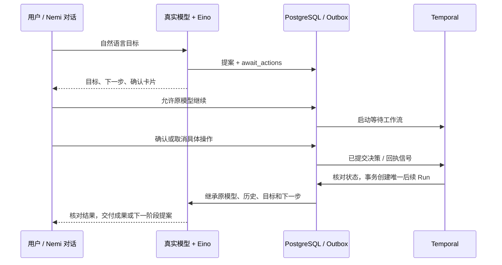

# 对话确认后的后台续办

日期：2026-10-05 · 代码 v0.10 · schema v11 · agent-v5 / plan-v2。

用户可以一次交代“保存安排，确认后整理报告”之类的目标。真实模型准备操作提案，并在下一步依赖确认时调用 await_actions。妮米在当前对话展示目标、下一步与确认卡片；用户允许原模型继续，再逐项确认或取消操作。后台随后核对实际结果并继续工作，无需重新输入目标。简单保存任务不强制建立续办。

## 用户能看到的流程

1. 妮米准备操作，显示内容、接收方或修改前后信息。
2. “允许确认后继续”允许使用本轮模型做后续工作，会产生模型费用并计入预算；它不会代替用户确认任何操作。
3. 所列操作都有明确决策后，后台继续处理真实结果。取消操作也是一种决策，模型必须据此调整处理，不能当作执行成功。
4. 成果出现在原对话，保留预览、下载和历史。续办显示为后台事件，不伪装成用户发送的新消息。

用户可在等待时停止后续执行，也可用新消息改变对话方向。停止不撤销已经确认的修改或已提交消息；已准备提案仍可独立确认。执行中的后续轮次可使用既有“停止本次任务”。首次平台开通、账号权限和资源授权仍需用户或管理员完成，内部卡片不能代替平台权限。

## 持久合同

- await_actions 只能引用本轮真实操作 ID，最多四项，至少一项待确认。必须单独调用，直接复用 Eino ReAct 的 SetReturnDirectly 暂停模型循环。
- 目标与下一步是模型规划数据，不能赋予新权限。外部来源只从真实用户原话获得授权，合成续办事件不进入 AgentUserMessages。
- PG 保存等待记录、用户许可、原模型配置 ID、运行链与期限。授权、审批、运行完成和回执变更与对应 Outbox 同事务提交；信号可能重复，后续运行只能创建一次。
- ContinuationWorkflow 只检查数据库并保存 durable timer / signal；等待期间没有模型调用。断网或 Worker 停机后，新的 Worker 从持久事实恢复，不能重放父轮次的付费请求。
- 后续轮次继承原配置 ID、模式和提示合同，用户切换默认模型不改变旧任务；撤销原配置会阻止后续请求。每个新轮次仍受现有单轮 / 每日预算与并发准入限制。
- 消息 APPROVED 不等于送达。短暂 SENDING 最多等待三十秒的回执观察；UNKNOWN 或 REJECTED 后，模型仅核对并说明结果，不自动重发。
- 单次等待不超过父轮次创建后的24小时，且不超出根任务创建后的七天；运行链最多八次后续轮次。各次新等待仍需用户明确允许。到期、原轮次失败、模型撤销、停止或新消息覆盖均阻止旧等待继续。
- 事务先锁运行和续办记录，再写业务事件；首次等待注册与审批共享独立锁，防止等待行尚未存在时的确认竞态。

## 验证与范围

专用 nemi_test 集成覆盖未允许不执行、全部决策后启动、十二并发唤醒仅一个子运行、默认模型切换仍继承原模型、撤销 / 到期 / 新消息 / 取消、七天及八阶段边界、未知消息回执不重发与事件锁顺序。

真实本地 Temporal 测试在 Worker 停机期间完成审批，替换 Worker 后只续办一次，父轮次模型请求不重放。隔离浏览器覆盖一条用户消息经审批交付可预览报告、刷新和手机布局、停止后独立确认仍有效、新消息阻止迟到续办。供应商替身仅编译进测试程序，不是产品生成回退；新工具链尚未额外用用户 Key 付费验收，也没有新增平台实账号验收。

这是一项有界审批续办能力。长期目标完成条件、持续研究、主动变化通知、全平台 OAuth 和云端电脑仍需实现；完整目标见[目标跟踪](./GOAL_AUDIT.md)。
