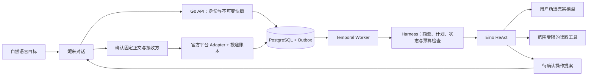

# Nemi 对话 Agent harness

日期：2026-10-05；实现 v0.7。主入口是自然语言目标，应用连接、信息补充和操作确认留在妮米对话中。用户不用自行选择工具或理解执行循环。首次获取平台权限仍由用户或管理员授权，内部配置卡片不能替代平台授权。

## 选型与实际复用

[DeepSeek 官方 deepseek-harness](https://github.com/deepseek-ai/deepseek-harness)提供插件化的工具、模型、执行循环及持久会话日志，目前标注为 developer preview。其[架构文档](https://github.com/deepseek-ai/deepseek-harness/blob/master/docs/architecture.md)区分会话事实与进程内事件；[Agent Loop](https://github.com/deepseek-ai/deepseek-harness/blob/master/packages/core/agent-loop/README.md)说明工具 guard、协作取消及未知操作结果的处理。

[Claude Code 执行说明](https://code.claude.com/docs/en/how-claude-code-works)和 [Hooks](https://code.claude.com/docs/en/hooks)提供上下文整理、工具前后检查及停止检查的参考。[Anthropic 长任务工程文章](https://www.anthropic.com/engineering/effective-harnesses-for-long-running-agents)强调持久进度和增量验证；只有摘要不足以保证长任务正确完成。

Nemi 采用这些设计原则，未引入 DeepSeek 的 Node / Cordis 运行时，也未复制其源码。Eino v0.9.21 已是现有 Go 依赖，本次直接复用其 `adk/middlewares/summarization`；ReAct 负责模型与工具循环，Temporal 继续拥有后台任务生命周期，PostgreSQL 保存业务事实和费用。避免重复拥有同一任务的持久执行状态。

## 会话整理

schema v8 为 conversations 增加 context_summary、summary_through，为 runs 增加 task_plan。创建运行时固定现有摘要、覆盖位置和此后的全部成功对话原文，失败轮次不当作已完成结果。

历史超过四个成功整轮，或历史加已有摘要超过 10000 字节时安排整理。通常保留最近两轮原文；近期内容过大时将更多旧整轮交给摘要。模型摘要合并旧摘要与选定前缀，最长 6000 字节。当前用户消息保留原文，不进入本次摘要。所有原始聊天记录仍在 chat_turns / runs 中。

摘要请求使用同一所选模型、同一预算账本和步骤 claim，名称为 context_summary；不带工具、不启用 SDK / HTTP 付费重试。有效结果按原覆盖位置 CAS 提交，再执行当前任务。无效摘要或无法保存检查点时停止本轮并保留已知费用，不以固定文本替代生成。停止后的 Worker 无权写入新摘要。

单次不可变会话快照上限 40000 字节，模型请求 JSON 上限仍为 48000 字节。旧版累积了非常长历史、无法在一次整理内处理时，明确要求新开对话并提供关键背景，不能悄悄丢掉未摘要原文。摘要有损，不保证逐字恢复；用户当前原话和实时操作状态优先。飞书链接授权从原始用户消息查询，不能由模型生成的摘要赋予权限。

## 任务计划与工具保护

update_plan 为复杂任务保存目标及 1–8 个步骤，状态为 pending / in_progress / completed，最多一步进行中；下一轮读取此前计划。界面明确标为 Agent 报告的规划进度，不能将计划标签当作平台操作凭证。简单聊天无需强制调用计划工具。

每轮最多六次模型请求（包括摘要）、十二次工具调用、十分钟 Activity。工具顺序执行，相同工具名与规范 JSON 参数最多执行两次，第三次触发 AGENT_TOOL_LOOP_DETECTED，终止本轮。不同参数仍受总次数及费用限制。未注册工具、无效参数、越权范围不能执行。

停止接口 `POST /api/v1/chat/runs/{id}/stop` 经身份、来源及幂等命令，将活跃 chat run 标为 FAILED / AGENT_CANCELLED。模型 claim、计划更新、摘要更新和提案写入共同检查持久状态；Worker 每三秒检查状态并取消在途 HTTP。已经提交的请求可能产生费用，已产生的提案仍可由用户独立确认，停止不撤销已确认操作。迟到响应只允许结算已知用量，不能把运行改回成功；未知费用继续占用预留。

## 对话应用操作

十项工具：get_current_time、list_matters、get_matter、list_memories、list_connections、read_feishu_document、propose_matter、update_plan、request_connection、propose_message。

- request_connection 在对话中提供飞书文档、飞书群、企业微信群、钉钉群的配置卡片。凭据专用字段直达现有配置 API，不写入聊天、模型上下文或 Temporal 参数。保存后可以点击继续原任务，由真实模型继续处理。
- read_feishu_document 读取用户明确提供且已授权的 docx 正文，并给模型继续分析。缺少连接时 Agent 引导配置；当前没有全量飞书聊天读取、wiki、附件或写回权限。
- propose_message 只生成待确认消息；服务端固定接收群名称、连接 ID、配置 revision 和正文。界面核对后才调用官方群机器人接口。提案确认、版本检查和投递 claim 同事务提交；Action ID 作为稳定投递键，换浏览器请求键也不重复投递。
- 消息确认与平台送达是不同事实。DELIVERED 表示平台接受，REJECTED 表示拒绝，SENDING / UNKNOWN 的重复请求只返回未知回执，不重新发送。下一轮从数据库读取真实回执，不能仅凭 APPROVED 声称送达。

当前应用目录中的高德仍为外部官方搜索入口，ICS 为单次导出，微信、邮箱、WPS、12306、购物等接口尚未接入。产品方向是逐步用内部工具结果与对话确认替代页面跳转；不能把目录展示误称为 Agent 已能控制所有应用。

## 验证与后续

单元和 nemi_test 集成验证覆盖：连续两次摘要仍保留最初约束、完整历史、下一轮计划恢复、摘要费用、无效摘要不重试、规范参数循环保护、停止后的工具 / 计划 / 摘要写入拒绝、迟到费用结算、确认前无投递、接收群变更拒绝旧提案、未知回执不重发和跨空间隔离。浏览器验证内部连接、继续任务、消息取消、移动端及刷新恢复。

测试模型与平台协议替身只存在测试程序中，不能当作外部账号真实验收。当前本机未配置真实模型及平台凭据。

后续仍需工具输入 / 输出持久回放、长期任务里程碑与可验证完成条件、用户授权后的 OAuth 连接、浏览器沙箱和接管、文件产物、检索、语义记忆与主动跟进。当前没有 Claude Code 的 Shell / 文件修改能力，也没有 DeepSeek 完整插件运行时或 Muse 的云端电脑。
