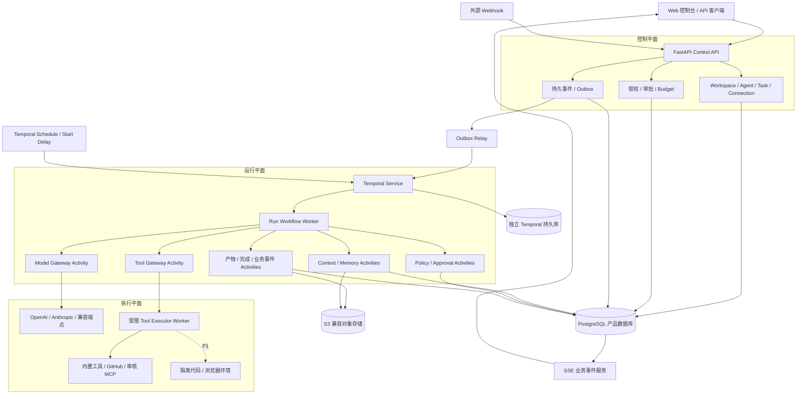
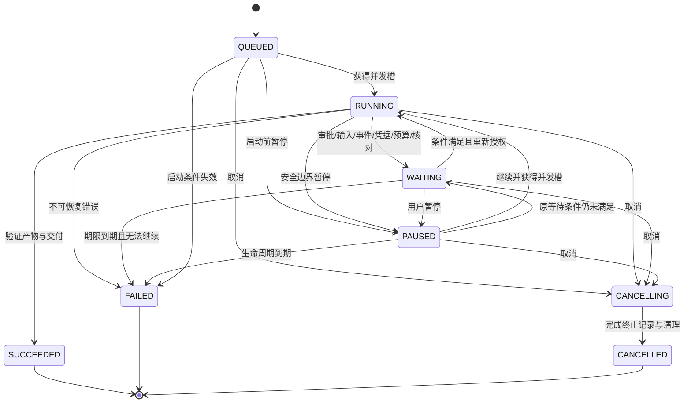
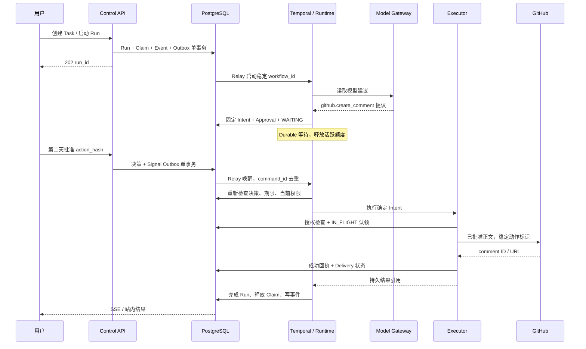

# Agent OS / Agent Cloud Runtime 技术架构文档

版本：v0.1 · 日期：2026-10-04 · 状态：实现前设计

配套需求见 [PRD](./PRD.md)。本文描述项目暂称 Orbit Runtime 的独立实现，设计中的类、接口和 JSON 是项目合同示例，不是现成 SDK 或已经运行的代码。

## 1. 架构结论

采用 **Next.js Web + FastAPI 模块化单体 + Python Worker + Temporal + PostgreSQL + S3 兼容对象存储**。模型、工具、记忆和权限以模块接口隔离；按负载和信任边界部署 Worker。

首版不再引入独立 Redis 队列、Kafka、NATS、LangGraph 持久化、图数据库或 Kubernetes。Temporal 是唯一的持久编排引擎；PostgreSQL 保存产品数据、执行账本、审批、预算、待发送命令和用户可读事件；文件内容放入对象存储。

模型提供思考与行动建议，Runtime 管理进度与预算，Policy 决定授权，Executor 执行确定动作。Agent Definition、具体实例、业务 Task 和业务 Run 分开建模。

### 1.1 关键决策与替代方案

| 决策 | 本稿选择 | 原因 / 代价 | 未选方案 |
| --- | --- | --- | --- |
| 业务服务 | 模块化单体 | 统一事务，便于小团队维护；需约束模块依赖 | 按十余项能力拆微服务 |
| 后端 | Python / FastAPI | 与模型及工具适配同一语言；长任务不放 HTTP 进程 | 同时维护 Go API 和 Python Runtime |
| Durable 执行 | Temporal | 复用恢复、计时、消息和 Activity 调度；增加学习及运维成本 | 自建 DB 租约 FSM / Celery 长循环 |
| 状态真相 | Temporal：执行控制；PG：业务记录与动作授权 | 避免两个引擎同时控制流程；必须明确跨系统一致性 | PG 与引擎各自推进同一 FSM |
| 模型接入 | 原生适配 + 兼容适配，Runtime 使用中立合同 | 保留供应商能力差异；需维护兼容测试 | 只依赖一种供应商消息格式 |
| 工具接入 | Registry + Policy + Executor | 权限与副作用统一处理；审核需人工配置 | MCP 调用绕过策略层 |
| 首版记忆 | PG 结构化条目 / 摘要 / 游标 | 可编辑、可溯源，降低复杂度 | 所有历史直接进入向量库 |
| 用户体验 | HTTP 命令 + SSE 持久事件 | 简单、可断线补发；Token 增量另作临时展示 | 仅保持 WebSocket 会话内状态 |
| 代码执行 | P1 独立隔离环境 | P0 用受控内置工具完成场景 | 在 API 或 Runtime 进程运行模型生成代码 |

Temporal 官方描述了执行历史与恢复机制，并将外部操作放在 Activity 中；本文据此选择其作为持久编排基础。[Workflow Execution](https://docs.temporal.io/workflow-execution)、[Activities](https://docs.temporal.io/activities)

选用 Temporal 不等于拥有第三方 exactly-once 能力。Activity 重试必须结合业务幂等、下游去重和结果核对；无法确定结果的外部写入不能自动重发。

## 2. 逻辑架构与实际部署

### 2.1 三个平面



图中的 Gateway / Memory / Policy 首版是 Python 模块，不代表独立微服务。Model Gateway 只做模型请求，不持有工具执行权限；Tool Executor 不具备任意修改 Runtime 状态的权力。

### 2.2 MVP 进程与基础设施

| 组件 | 部署方式 | 职责与隔离 |
| --- | --- | --- |
| Web | Next.js 服务 | 交互、预览和 SSE 消费；不持有供应商 Key |
| Control API | FastAPI 服务 | 身份、配置、查询、命令接收和 Webhook 验签 |
| Runtime Worker | Python 服务 | Workflow 和可信的模型 / 上下文 / 完成 Activities |
| Executor Worker | 独立 Python 服务 | 外部工具调用和受控文件工具；最小凭据及网络访问 |
| Outbox Relay / Reconciler | 同代码库的独立进程 | 命令投递、控制面同步、状态和副作用核对 |
| Temporal | 自托管或托管服务 | Workflow 历史、Task Queue、Timers、Schedules |
| PostgreSQL | 可同一实例，独立数据库与账号 | 产品库与 Temporal 持久库不共享表和账号 |
| 对象存储 | S3 兼容 | 输入、工具原始结果、上下文、模型输出及产物 |
| 反向代理 | HTTPS 入口 | TLS、请求限制、SSE 超时配置 |

Scheduler 使用 Temporal Schedule，不再常驻一个自己 sleep 的 Scheduler Worker。Reconciler 通过持久 Outbox 同步产品配置与 Temporal 对象。

首版在 Linux 服务器运行；Windows 开发可以通过 WSL2 / Docker Desktop 启动依赖。版本在实现时固定并记录锁文件，本稿不把“当前最新”作为生产版本策略。

## 3. 领域模型与数据库

### 3.1 身份与引用

所有产品对象包含 `workspace_id`。产品使用的 `run_id` 与 Temporal 的 `Run ID` 是不同 ID；业务 Run 可因工作流版本迁移或 Continue-as-New 对应一条 Temporal execution chain。

```text
Agent Definition（不可变版本）
           ↓ 被实例引用
Agent Instance（Workspace、记忆域、连接引用）
           ↓ 有多个职责
Task（once / persistent）
           ↓ 被 Trigger 创建执行
Business Run（固定启动快照）
           ↓
Step（稳定逻辑 ID）→ Attempt（实际调用、费用、错误）
```

触发计划和职责不会因某次 Run 完成被销毁。Agent 的长期存在以数据库记录、Trigger 和记忆实现，空闲时不占用一个专属执行进程。

### 3.2 表结构概要

| 表 | 关键字段 | 约束 / 用途 |
| --- | --- | --- |
| users / workspaces / memberships | identity、owner、status | P0 一个 Owner；仍按成员关系授权 |
| agent_definitions / agent_versions | definition_id、version、config_json、hash | 版本不可变；version 在 definition 内唯一 |
| agent_instances | workspace_id、version_id、state、memory_namespace | 不存明文凭据 |
| tasks | agent_instance_id、mode、objective_ref、status、revision | 保存持续职责与完成条件 |
| triggers | task_id、kind、spec_json、timezone、revision、sync_status | 多触发规则；记录期望 / 实际同步状态 |
| model_connections / model_profiles | endpoint、provider、credential_ref、capabilities、price_version | 能力与价格有来源和时间 |
| connector_connections / tool_versions | connector_ref、schema、effect、risk、policy_floor | 审核工具版本不可变 |
| credentials | encrypted_secret、wrapped_key、key_version、revoked_at | 受限访问，密钥不在产品表中扩散 |
| inbound_events | source、external_id、payload_ref、verified_at、status | `(workspace_id, source, external_id)` 唯一 |
| trigger_occurrences | trigger_id、revision、nominal_time_utc、dedup_key、decision | 记录 accepted / skipped / stale / misfire |
| runs | task_id、trigger_key、snapshot_ref、status、wait_reason、delivery_status、state_revision | 固定快照；触发键在 Task 内唯一 |
| workflow_bindings | run_id、workflow_id、temporal_run_id、worker_build、chain_index | 显式保存业务 / Temporal 对应关系 |
| steps | run_id、ordinal、kind、input_ref、output_ref、status | `(run_id, ordinal)` 唯一 |
| step_attempts | step_id、attempt_no、provider_request_id、usage、error、timestamps | `(step_id, attempt_no)` 唯一 |
| operation_intents | run_id、step_id、action_hash、idempotency_key、state、external_ref | 写入动作账本，键唯一 |
| approvals | intent_id、action_hash、requester、decision、expires_at、consumed_at | 决策一次；绑定确定动作 |
| run_commands | command_id、run_id、kind、payload_ref、status、version | 幂等接收控制命令 |
| budget_accounts / reservations / usage_ledger | scope、currency、limits、reserved、settled、price_version | 费用预留与结算分开 |
| task_claims / execution_slots | task_id、run_id、lease、generation | Task 排他与活跃并发额度分开 |
| memory_items / source_cursors | namespace、type、content_ref、provenance、revision | 可删除、可解释、来源去重 |
| artifacts | run_id、object_key、hash、content_type、size、status | staged / available / deleted |
| business_events | workspace_id、run_id、seq、type、payload_ref | `(run_id, seq)` 唯一，SSE 数据源 |
| outbox | command_id、kind、target_id、revision、payload_ref、state、next_attempt_at | 跨系统投递至少一次 |
| notifications / audit_records | dedup_key、actor、action、result、timestamp | 通知去重；审计不保留原始秘密 |

`workspace_id` 与对象 ID 形成复合外键或等价约束，防止把其他 Workspace 的凭据、连接、工具或产物关联到本空间。除业务必需的唯一键外，列表主要索引为 `(workspace_id, created_at)`，运行索引为 `(workspace_id, status, updated_at)`。

模型和工具 Attempt 均计入 `max_attempts`；上下文读取、权限检查、事件投影等基础设施 Activity 不耗 Agent 的逻辑 Step 上限，但有自己的超时、重试上限和告警。

### 3.3 配置快照

每个 Run 启动时固定：Agent 版本、Task revision、模型候选、工具版本、目标来源、原始预算和完成条件。引用均带内容 hash。快照保证可解释性，不冻结授权。

执行前的实际权限为：

```text
Run 快照允许范围
∩ 当前 Workspace / 用户授权
∩ 当前 Connection / 资源授权
∩ 平台工具最低限制
∩ 当前撤销与禁用状态
```

用户事后收紧权限必须生效。新增更广权限或工具进入后续 Run；审批不能把当前 Run 扩展到未获准的新资源。用户记忆纠正与删除可在后续上下文构建生效，并记录采用的 memory revision。

## 4. 状态机与状态所有权

### 4.1 Run 状态转换



所有状态转换经 Runtime 的版本化命令与幂等持久 Activity 落库。API 只接收请求并更新“请求暂停 / 请求取消”的命令记录，不直接宣称实际执行已经停止。

取消仍可留下 `delivery_status=UNKNOWN` 和未结算费用；用户主任务不继续，但 Reconciler 保留核对责任。终态不重新打开；再次执行创建 `retry_of_run_id` 关联的新 Run。

### 4.2 执行状态与业务状态的边界

| 信息 | 所有者 | PG 如何使用 |
| --- | --- | --- |
| 下一步运行、计时器、等待消息、Activity 调度 | Temporal Workflow history | PG 不另建一个驱动这些流程的 FSM |
| Run 展示状态、Step 账本、结果 | 幂等业务 Activities | 提供查询、SSE 和评估，可核对修复 |
| 当前授权、批准是否有效、动作是否允许提交 | PG Policy / Approval / Operation ledger | Executor 必须重新检查，不能靠旧 Workflow 快照 |
| 外部评论是否发布 | 外部回执 + PG 结果核对 | 结果不明时不能从 Workflow completed 推断成功 |
| 页面 Token 增量 | 临时流 | 不是成功证据，不参与恢复 |

Activity 返回之前先提交业务结果和状态；若提交成功但结果未被 Temporal 记录，重试通过稳定 ID 读回原结果。若提交未发生，Temporal 历史不应已有成功输出。独立 Reconciler 检测停滞、终态不一致和待处理动作，不任意重启整个 Workflow。

## 5. 持久 Runtime 与 Agent Loop

### 5.1 Temporal 映射

| 产品对象 / 行为 | 编排实现 |
| --- | --- |
| 一个业务 Run | `RunWorkflow`，绑定业务 ID 与执行链 |
| 模型、工具、上下文、持久化 | 有明确输入输出的 Activities |
| 用户审批、输入、暂停、取消 | 带 command_id 的 Signal / Update 消息，消息仅作为唤醒线索 |
| 审批有效期 / 继续时间 | Durable Timer，结合 PG 时间再次校验 |
| 周期职责 | Temporal Schedule 启动 `ScheduledRunWorkflow` |
| 一次性未来任务 | Start Delay，保存可取消的工作流绑定 |
| P1 Child Run | Child Workflow + 独立业务 Run，继承权限与预算上限 |

`ScheduledRunWorkflow` 接收 trigger ID / revision 和真实计划时间，通过幂等 Activity 创建或取得业务 Run，再启动 `RunWorkflow` Child 并等待结束。这样 Schedule 的 overlap=SKIP 覆盖整个业务执行时间。若使用“触发后立即返回”的短分发 Workflow，Schedule 自身的重叠策略不能限制业务 Run；本稿不采用该行为。

手动运行从 API 持久事务创建 Run，再通过 Outbox 启动 `RunWorkflow`。Webhook 先由 API 持久接收，事件分发用例在匹配规则、获得 Task claim 后创建 Run 和启动 Outbox；忙碌时保留 DEFERRED。所有路径都经过 PG Task 排他检查，所以手动、Webhook 和计划之间也不会绕过并发规则。

### 5.2 工作流确定性约束

Workflow 代码只进行确定性决策并调用 Temporal SDK 原语。网络、数据库、随机 UUID、真实时间读取、模型请求、检索和工具执行都放入 Activities；使用工作流确定性的时间与计时机制。

历史记录只保留小型结果引用、决策代码、hash 和必要状态。上下文原文、工具大结果、模型响应及文件放加密对象存储。默认每次业务 Run 有 30 Step / 60 Attempt 上限，长时间的是 WAITING，不是无上限推理。

Worker 升级须用版本路由或兼容 patch，并对真实脱敏历史做 replay 测试。已运行的 Workflow 不直接部署不兼容控制流；确需 Continue-as-New 时携带业务 Run ID、下一 Step 序号、账本引用和待处理 command IDs，Temporal Run ID 更新，业务 Run ID 不变。P0 优先保持单个有界执行，Continue-as-New 不是日常运行的前置条件。

### 5.3 有限 Agent Loop

下列伪代码描述合同，省略异常捕获和 SDK 细节，不可直接复制运行：

```text
load_start_snapshot(run_id)
acquire_task_claim(run_id)               # 从 QUEUED 起至终态，WAITING 时仍占 Task

for decision_round in bounded_rounds:
    apply_pending_commands()
    enforce_lifecycle_deadline()
    if paused_or_waiting:
        release_active_execution_slot()
        await_durable_signal_or_timer()
        recheck_current_grants()
        continue_from_same_logical_position()

    acquire_active_execution_slot()
    enforce_step_attempt_and_active_time_limits()
    context = build_context_activity(run_id, current_revision)
    decision = model_step_activity(stable_step_id, context.ref)

    if decision.kind == ASK_USER:
        persist_wait_and_request()
    elif decision.kind == TOOL_CALL:
        persist_validated_operation_intent()
        policy = evaluate_current_policy_activity(intent_id)
        if policy == ASK:
            create_exact_approval_and_wait()
        elif policy == DENY:
            record_denial_as_observation()
        else:
            execute_intent_activity(intent_id)
    elif decision.kind == FINISH:
        validate_artifacts_and_required_delivery()
        finalize_run_activity()
        break

on_terminal:
    release_task_claim_and_active_slot()
```

等待不消耗新的决策轮次；`continue_from_same_logical_position` 是恢复当前 Step，不重做已完成推理。模型一次输出多个工具调用时，P0 按稳定序号顺序执行；写动作分别授权，执行结果以原 call ID 回填。P1 再引入安全的只读并行。

### 5.4 重试、超时与幂等

| 类别 | 初始策略 | 结果不明的处理 |
| --- | --- | --- |
| PG / 内部持久化 Activity | 1、2、4、8 秒退避，最多 5 次；稳定对象 ID | 先读幂等结果再写入 |
| 普通读取工具 | 请求 30 秒，最多 3 次，尊重限流 Retry-After | 重读可接受，但记录全部 Attempt |
| 模型请求 | 请求 120 秒，最多 2 次实际请求，失败再考虑已授权回退 | 保留未知计费预留，禁止默认无限重试 |
| 已有下游幂等保证的写操作 | 相同动作、相同键，有限重试 | 先查下游结果，重复请求不得改变参数 |
| 缺乏幂等保证的写操作 | 自动实际提交最多 1 次；内部 Activity 重试只读账本 | 转 UNKNOWN → RECONCILIATION，核对前不重发 |
| 无效凭据 / schema / 权限拒绝 | 不重试 | 等待重连或失败 |

Activity 的 SDK 重试和 Adapter 内部 HTTP 重试只能由一层控制，不能相乘。实际请求发出前递增 Attempt 并预留费用；进程崩溃留下 IN_FLIGHT 时采用保守核对。整个业务 Workflow 失败后不自动从头重跑；Workflow Task 自身的恢复与业务重新执行区分处理。

### 5.5 Task 排他与活跃额度

同一 Task 从 Run 准入至终态持有一个排他 claim，包含 QUEUED / WAITING / PAUSED；因此审批等待期间新的周期执行被记录为 skipped，不堆积无限队列。

活跃 execution slot 独立管理：全局 5、Workspace 2；WAITING / PAUSED 释放，恢复时重新获取。运行的单个工具 / 模型请求仍计占用至返回或确认结束；等待配额可以用 durable timer 退避，不调用模型轮询。

租约与 generation 防止过期 Worker 提交本地结果。**fencing token 只能约束接受它的系统，不能阻止旧 Worker 已发往第三方的动作。** 未知外部写入保持动作锁，不因租约超时自动由第二个 Worker 重发。Reconciler 仅在确认执行终态或完成核对后释放残留 Task claim。

## 6. API、事件与跨系统一致性

### 6.1 HTTP 合同

统一前缀 `/api/v1`。所有 Workspace 级路由首先验证 membership，再验证对象及连接授权。修改命令支持 `Idempotency-Key`；同键不同请求体返回 409。

| 方法 / 路径 | 用途 | 主要语义 |
| --- | --- | --- |
| POST `/workspaces/{ws}/model-connections` | 新建模型连接 | Key 只接受写入，返回掩码与引用 |
| POST `/model-connections/{id}/validate` | 测试连接与能力 | 202；受端点策略和测试预算限制 |
| POST `/workspaces/{ws}/agents` | 创建实例和初始版本 | 201 |
| POST `/agents/{id}/versions` | 发布配置新版本 | 201；需 expected revision |
| POST `/agents/{id}/tasks` | 创建职责 | 201；未保存 Trigger 不自动调度 |
| POST `/tasks/{id}/runs` | 手动启动 / 试跑 | 202；返回持久 run_id 和 QUEUED |
| POST `/runs/{id}/commands` | pause / resume / cancel / input / raise_budget | 202；返回 command_id，不假装已执行 |
| GET `/runs/{id}` | 状态、交付与用量 | 显示 requested 与 effective state |
| GET `/runs/{id}/steps` | 分页时间线 | 不泄漏秘密与隐藏推理 |
| GET `/runs/{id}/events` | SSE | 从 Last-Event-ID 补齐 |
| POST `/tasks/{id}/triggers` | 保存计划或事件规则 | 返回 sync_status=PENDING，生效后 APPLIED |
| PATCH `/triggers/{id}` | 修改 / 暂停 | 乐观 revision 检查 |
| POST `/approvals/{id}/decision` | approve / reject | 409 表示冲突 / 参数变更，410 表示过期 |
| POST `/webhooks/{trigger_public_id}` | 外部来源接入 | 验签后持久入库，202 即接收而非执行完成 |
| GET `/artifacts/{id}/download` | 申请短期下载地址 | 先鉴权；不能直接按 object_key 下载 |
| GET / PATCH / DELETE `/memory/{id}` | 管理记忆 | 变更 revision，后续读取即时受删除约束 |
| GET `/workspaces/{ws}/usage` | 用量与估算费用 | settled / reserved / unknown 分开展示 |

暂停 Run 在安全边界生效，不立即中断已在途的评论提交。紧急取消请求首先落 PG cancellation fence，Executor 开始新请求前再次检查；已越过提交点的动作仍需结果核对。

### 6.2 事件格式与 SSE

项目事件采用中立 envelope，不声称实现完整 CloudEvents 或 AG-UI 标准。P1 可以增加协议适配层。

```json
{
  "event_id": "evt_01",
  "workspace_id": "ws_01",
  "run_id": "run_01",
  "sequence": 18,
  "type": "run.waiting",
  "occurred_at": "2026-10-04T01:04:00Z",
  "payload": {
    "reason": "APPROVAL",
    "approval_id": "apv_01"
  }
}
```

持久事件包括 `run.queued / run.started / step.started / step.completed / step.failed / approval.requested / approval.decided / run.waiting / run.resumed / artifact.available / usage.updated / run.completed / run.failed / run.cancelled`。

SSE 的 ID 使用 Run 内 sequence。PG NOTIFY 可用于提示读取新记录，但不是可靠消息存储；重连以表中的 sequence 为准。超过事件保留范围返回需重新获取快照的明确响应。Token delta 可在界面临时显示，未持久的增量不保证重放；最终模型输出和 Step 结果仍持久化。

### 6.3 Outbox 合同

创建手动 Run 的单个 PG 事务写入 Run、Task claim、事件和 `START_WORKFLOW` Outbox。提交成功后 API 才返回 202。

Relay 以 `FOR UPDATE SKIP LOCKED` 认领 Outbox，发送命令后标记已投递。手动工作流 ID 为 `run/{workspace_id}/{business_run_id}`，禁止重复启动同一 ID；如果发送成功后 Relay 崩溃，重发收到“已存在”即核对 binding 并完成。Outbox command_id 和接收命令记录负责语义去重。

审批决策事务更新 Approval，并写入 Signal Outbox。Signal 到达后 Workflow 通过 Activity 重新加载 PG 决策，不信任 Signal 中自带的批准值；command_id 防重复。提前到达、重复、迟到审批都需处理，已终态 Run 不能因迟到批准被重新执行。

Trigger 配置先写 desired revision，Relay upsert / pause Temporal Schedule。失败期间界面显示未同步；重放旧 revision 时检查当前 desired revision，不能用旧配置覆盖新配置。即使 Temporal 更新延迟，运行准入仍检查当前 PG 的 Trigger enabled / revision，旧计划只产生 skipped 记录。

### 6.4 触发去重、补跑与时间

| 来源 | 去重键 |
| --- | --- |
| 手动 | `workspace + Idempotency-Key`，与 Task 绑定 |
| 计划 | `trigger_id + revision + nominal_time_utc` |
| Webhook | `workspace + source + verified external_event_id` |
| 一次性任务 | `trigger_id + revision + target_time_utc` |
| P1 子任务 | `parent_run_id + delegation_step_id + child_index` |

周期计划使用 Temporal Schedule；Overlap 设置 SKIP，Catchup Window 显式设置 10 分钟，不使用引擎的默认长期补跑窗口。最新一次补跑规则还需要准入层实现：对 nominal time 计算截至当前时间的最新合法 occurrence，过时候选标为 misfire；同批最新候选以唯一键接受。**仅设置 Catchup Window 并不能保证多次错过只补一次。**

Schedule 控制、时区与补跑策略的基础语义可查官方说明。[Temporal Schedule](https://docs.temporal.io/schedule)

按时间触发优先保存原时区、规范化 spec 和 UTC occurrence。未来三次预览使用与引擎相同的日历计算，并记录 tzdata 版本。涉及夏令时跳时或重复的时区需显示预览并测试；无效本地时间不静默改时，重复时间以实际 UTC occurrence 区分。本项目不另外实现一套与引擎不一致的 Cron 解析器。

Webhook 必须校验原始请求体签名、时间窗口与来源 delivery ID；对 body 大小和速率限额。来源未提供可用稳定 ID 时要求上游提供签名 event_id，P0 不以易碰撞的随机或正文截断 hash 假装可靠去重。入库后立即响应，执行异步进行。

同一 Task 忙碌时，周期触发 skipped；手动启动返回 409 并链接已有 Run；Webhook 保留为 DEFERRED 事件，完成当前 Run 后合并待处理事件为下一次执行。P0 每 Task 待处理事件上限 1,000，超限拒绝接收并告警，来源可重试；不会在已响应接收后悄悄删除。定时全量读取仍作为事件漏发的补充。

## 7. Model Gateway 与多模型路由

### 7.1 中立请求 / 响应合同

Runtime 只依赖 `ModelAdapter.generate(request, attempt_context)`。Provider 特有字段由 Adapter 转换，调用者不直接构造 Anthropic 或 OpenAI 消息格式。

```text
ModelRequest
  connection_ref / model_id / capability_requirements
  instructions / context_ref / conversation_blocks
  tool_descriptors / optional_output_schema
  max_output_tokens / deadline / optional_reasoning_controls

ModelResponse
  blocks: Text | ToolCall | Refusal | StructuredResult
  finish_reason: COMPLETE | TOOL_CALLS | LENGTH | REFUSAL | ERROR
  usage: input / output / cache / provider-specific counters
  provider_request_id / normalized_error / response_ref
  opaque_continuation_ref（可选，供应商专属且不跨供应商）
```

Provider 返回的工具调用只是一项提议，必须经过本平台 schema 校验、授权和执行。OpenAI 官方工具调用说明可作为原生适配实现依据；其他 Adapter 使用各自原生合同并做兼容测试。[Function calling](https://developers.openai.com/api/docs/guides/function-calling)

P0 Adapters：`OpenAIResponsesAdapter / AnthropicMessagesAdapter / OpenAICompatibleChatAdapter`。Gemini 原生、Ollama、Azure、Bedrock 等为后续扩展，不能用一项“兼容”开关承诺它们的全部能力。

内容块保留工具 call ID、结果 ID 与供应商必要续接字段。原生推理模型可能要求不透明续接数据，允许加密存储这些字段，不将它们展示为推理文本。跨供应商回退重建中立上下文，不能把专属签名、不透明 token 或供应商 session ID 直接交给另一个 Adapter。

### 7.2 能力 Profile

```json
{
  "connection_id": "mc_01",
  "model_id": "user-selected-model",
  "capabilities": {
    "tool_calling": "SUPPORTED",
    "structured_output": "UNKNOWN",
    "vision": "UNSUPPORTED"
  },
  "context_window": {
    "value": 32000,
    "source": "operator_declared"
  },
  "verified_at": "2026-10-04T00:00:00Z",
  "contract_test_version": "model-contract-v1"
}
```

数字是示例，不代表任何真实模型的规格。测试能证明某项行为在样本上可用，不能测出全部上下文上限或保证模型永远遵守 schema；人工声明与实际测试分别记录。

硬要求缺少能力或为 UNKNOWN 时默认不通过。不要把工具调用转换为“让模型输出 JSON 后当代码执行”的隐式降级；纯文本任务可以不要求工具能力。

### 7.3 路由与回退

按以下顺序筛选和执行：

1. Workspace 允许的数据外发供应商、端点与地区。
2. 当前 Connection 未撤销，模型硬能力满足。
3. 当前上下文能适配该模型，必要工具 schema 可转换。
4. 预算、供应商配额和连接并发可满足。
5. 按用户配置的默认模型与有序候选选择。

P0 不使用未经评测的“质量分数”自动选模型。429 / 临时 5xx / 明确服务不可用可以触发有限回退；401 等凭据问题直接标记连接异常。输出截断、拒答和 schema 错误分别处理，不通过跨供应商切换绕过用户或平台限制。

每次回退是一项新的 Attempt，记录供应商、原因、价格版本和预算预留。之前请求可能已计费，即使没有最终输出也不能从账目抹去。可用模型均不满足条件时进入 WAITING(CREDENTIAL / BUDGET) 或清晰失败。

### 7.4 自定义端点与网络范围

云端用户提供的 Base URL 仅允许 HTTPS、受审核域名和端口；禁止访问 loopback、link-local、metadata、私网 IP 与未授权内网地址。每次 DNS 解析、跳转和连接都由 egress 代理校验，控制 DNS rebinding 与重定向绕过。API Key 仅发给原始授权端点，不携带到异域跳转。

私有模型和本地模型在 P1 通过受控出站连接器或专用私有执行池支持，隔离于公网用户可配置端点。不能让普通 Workspace 通过“模型 Base URL”探测服务端内网。

## 8. Tool Registry、Policy 与副作用账本

### 8.1 工具描述合同

```json
{
  "tool_id": "github.create_comment",
  "version": "1",
  "protocol": "HTTP_ADAPTER",
  "input_schema": {
    "type": "object",
    "properties": {
      "repository": {"type": "string"},
      "issue_number": {"type": "integer", "minimum": 1},
      "body": {"type": "string", "maxLength": 10000}
    },
    "required": ["repository", "issue_number", "body"],
    "additionalProperties": false
  },
  "effect": "EXTERNAL_WRITE",
  "minimum_policy": "ASK",
  "idempotency": "RECONCILE_ONLY",
  "required_scope": "repository.issue.comment.write",
  "timeout_seconds": 30,
  "max_submit_attempts": 1
}
```

scope 是本平台的逻辑权限，Adapter 再映射为供应商实际所需授权；它不是对某个 GitHub OAuth scope 名称的声明。

P0 工具三类：`READ / WORKSPACE_WRITE / EXTERNAL_WRITE`。读取可以有数据泄漏风险，仍检查目标和来源边界；工作区写入限制在当前 Run 的对象前缀；外部写入逐次审批。MCP hints / 工具说明属于供应商输入，不能自行降低 minimum_policy。

工具输入与输出都做 schema 和大小限制；tool ID 与版本不在 Run 白名单就拒绝；过大结果写入对象存储，只将引用与摘要回填。工具结果包含来源、截取范围和错误，不能用一段成功文本覆盖实际调用失败。

### 8.2 权限顺序与审批绑定

限制顺序为平台强制边界 → Workspace 授权 → Connection / Resource 范围 → Run 白名单 → 用户授权 → 一次审批。DENY 优先；ASK 只能由对应有效批准满足。模型不能直接修改规则。

审批动作 hash 至少绑定：

```text
workspace / actor / credential_identity
run / step / tool_version / schema_hash
canonical_arguments / target_resource
artifact_content_hash（若发送附件）
policy_revision / expires_at
```

canonical_arguments 使用确定性 JSON 规范化；目标仓库、Issue、正文都进入 hash。审批仅消费一次；相同 intent 的恢复可继续核对原动作，不能用已消费审批发起新动作。

批准后无需再请求模型改写内容。若有改稿、换目标或换发送身份，创建新 Intent 与新 Approval。权限在等待期间收紧时重新判定，原批准不覆盖新 DENY。

### 8.3 操作账本状态

```text
PREPARED → WAITING_APPROVAL → AUTHORIZED → IN_FLIGHT
                                           ├→ SUCCEEDED
                                           ├→ FAILED_CONFIRMED
                                           └→ UNKNOWN → RECONCILING
                                                          ├→ SUCCEEDED
                                                          ├→ FAILED_CONFIRMED
                                                          └→ MANUAL_REQUIRED
```

提交过程：

1. 持久化经过校验的 Intent、固定参数、内容 hash 和稳定幂等键。
2. 策略决策与审批满足后，Executor 再检查撤销、取消、当前授权。
3. PG 条件更新认领 Intent，记录 attempt / generation；先提交 IN_FLIGHT，再发请求。
4. 有下游幂等机制时传相同键；无机制时不谎称本地键能消除远端重复。
5. 将可验证外部 ID / URL 与结果写入 PG，最后回传 Activity 结果。
6. 遇到超时、连接中断或进程失联，将残留 IN_FLIGHT 核对为 UNKNOWN，不把它直接当作可重试失败。

对 GitHub 评论可以在**审批预览中显式包含**稳定动作标记，并检索同 Issue 的标记 / 发送身份核对；或者用保存的远端 ID 查回。该方法只是应用级核对，受分页、可见性和并发影响，不等于原子幂等。没有确定证据时保留 MANUAL_REQUIRED。任何重新提交都必须确认原请求不再在途、核对其未生效，并走明确的重新授权；P0 默认交给用户处理。

动作取消与网络提交间存在竞争窗口，系统仅承诺取消生效后不启动新的动作，并准确记录已越过提交点的动作。撤销与取消不能收回已发布内容。

### 8.4 MCP 接入边界

P0 仅接入管理员审核的远程 MCP。记录 server identity、允许端点、工具列表、schema hash、授权来源和版本。`tools/list` 变化只生成待审核变更，不自动授予新工具。

MCP Server 不能获取所有 Workspace 的凭据。调用经同一个 Tool Gateway / Policy / Ledger；远程内容不作为高优先级系统指令。不在 API 进程启动任意用户提交的 stdio server；本地 stdio 工具放 P1 的隔离执行环境。

## 9. Memory、Context 与 Artifact

### 9.1 首版记忆实现

| 类型 | 保存内容 | 加载规则 |
| --- | --- | --- |
| Working | 当前目标、近期对话、工具观察、待完成步骤 | 当前 Run；按 Token 预算摘要 |
| Episodic | Run 的已验证摘要、结果位置、用户决定 | 默认 Agent Instance 域，按最近与相关标签检索 |
| Semantic | 用户确认的偏好和项目知识 | 明确共享范围、来源与 revision |
| Source cursor | 已处理外部对象 ID、内容版本、最后成功位置 | 按 Task 和来源读取，提交后推进 |
| Artifact metadata | 文件路径、hash、来源、类型 | 权限过滤后以引用访问 |

P0 使用结构化过滤、标签和全文检索；无需 embedding。P1 引入 pgvector 时，embedding_model / dimension / version 单独记录，迁移用重建索引与双读验证；检索先按 Workspace / namespace 限制，不能先全局向量召回再在 UI 隐藏其他用户结果。

外部资料提取出的“用户偏好”属于候选，未确认不写入指令级记忆。历史摘要依据业务账本和外部回执生成，不把模型自称已经完成当作完成事实。

### 9.2 上下文流水线

```text
任务约束与当前授权摘要
→ 当前状态与未完成动作
→ 用户最新输入
→ 当前模型可用工具 schema
→ 权限范围内的相关记忆
→ 最近且必要的对话与工具观察
→ 来源内容片段及对应引用
→ 长度检查 / 摘要 / 输入 hash
→ ModelRequest
```

Token 预算依据目标模型配置动态计算，保留输出额度；固定优先级的约束不被普通截断删除。供应商计数工具可用时使用，兼容端点使用保守估算并记录误差；不能把一个 tokenizer 的准确性推广到所有模型。

Context Pack 保存来源 ID、内容 hash、memory revision 和截取范围。删除记忆或撤销资料授权后，下一次模型请求重建 Pack 并使旧缓存失效；不对已送出内容声称可撤回。回退至更小上下文模型时重新组装，适配失败则停止该候选。

### 9.3 文件提交与去重游标

对象前缀为 `workspace/{ws}/runs/{run}/...`；不能仅靠前缀保证安全，下载仍走 API 授权。默认输入 10 MB、工具响应原文 5 MB、单产物 20 MB，每 Workspace 1 GB 初始配额，管理员可调。

文件发布采用：上传 staged 对象 → 校验 hash / 大小 → PG 事务把 Artifact 标为 available、写业务事件、推进本批来源 cursor → 提交。对象存储不是 PG 事务参与者；上传失败不推进 cursor，PG 失败留下的 staged 对象由 GC 清理。

对于“起草并发送”的职责，起草文件和远端交付分阶段记录。发送失败仍可查看草稿，但 delivery 未完成。游标可以标记“已读取 / 已起草 / 已交付”不同状态，不能用起草完成跳过必要的未完成交付。通知自身也有 dedup_key，避免恢复重复提醒。

HTTP 抓取限制协议、域名、大小、重定向、内容类型和耗时；公开来源读取失败不改变成功游标。报告引用基于已读取来源映射，模型生成的陌生 URL 需要核验或剔除。

## 10. 执行环境与 P1 沙箱

### 10.1 P0：受控工作区

P0 仅支持经过代码审查的内置文件工具、读取工具和审核连接器。文件通过对象存储和临时受控目录读写；禁止接受任意 shell 字符串，禁止在 Runtime / API 进程 eval 模型输出。

HTML 获取是 HTTP 工具，不假装具有浏览器登录、JavaScript 交互或桌面控制能力。报告通过确定模板与文件写入产生，无需让模型运行任意 Python。

### 10.2 P1：隔离代码与浏览器

Runtime 通过 `ExecutionSession` 接口请求一次执行环境，记录 workspace / run / session / image digest、资源限制、网络规则和生命周期。计算环境是临时资源，可持久化的是文件与 Session 元数据。

初始资源目标：每 Session 1 vCPU / 1 GB RAM / 1 GB 临时磁盘 / 最长 10 分钟。浏览器与代码使用独立镜像；租约到期清理；等待审批释放环境，继续时重建并加载获准文件。进程状态或已登录浏览器不能声称天然可恢复。

单人自托管开发可以使用非 root Docker、只读根文件系统、capability drop、seccomp、无 host mount、无 Docker socket、默认拒绝网络、资源限额；但普通共享内核容器不构成面向恶意租户的完整隔离保证。公众多租户开放前使用经验证的专用隔离池、gVisor / microVM 等适当方案，并完成逃逸、跨租户、网络和凭据测试。

沙箱默认不注入供应商 Key 和数据库凭据。需要访问外部服务时通过受控 Tool Broker / egress proxy 获得短期、资源受限授权。Playwright 进程、下载、页面内容同样归属当前 Session；用户认证浏览器状态只按用户授权保存。

## 11. 凭据、租户与信任边界

### 11.1 Credential Store

接口为 `resolve(credential_ref, workspace_id, tool_or_model, operation_context)`。按职责限制访问：Model Gateway 仅可解密本次选中的模型凭据，Executor 仅可获得本次调用所需连接凭据；Workflow、LLM、前端与普通查询服务只接触引用。

P0 自托管采用 authenticated encryption 的 envelope 模式：Secret 用独立数据密钥加密，数据密钥由外置主密钥保护；主密钥不进入数据库或仓库。生产部署可接 KMS / Secrets Manager。记录 key version，支持轮换与撤销；没有可用密钥时服务拒绝调用。

密钥只在受限组件内短暂出现明文，因此“只存引用”不意味着明文从不出现。严格限定内存和日志路径，禁止记录 Authorization header / OAuth refresh token，审计仅记录 credential_ref 与访问原因。连接删除先标记 revoked，后续动作重新读取并拒绝。

### 11.2 Workspace 隔离

API 和每项后台 Activity 显式传递并检查 Workspace，而不是相信请求体或 Signal 的 workspace_id。DB 用无超级用户 / 无 BYPASSRLS / 非表 Owner 的应用账号；核心租户表使用 RLS，读写政策同时检查 workspace，迁移账号单独管理。

事务内 `SET LOCAL` 当前 Workspace，连接归还池时上下文不泄漏。RLS 是防御层，不能代替 API 授权、复合外键和对象存储授权。Worker 的运行身份与角色不得默认跳过隔离。PostgreSQL 官方说明表 Owner、超级用户与 BYPASSRLS 的绕过行为，需要据此正确配置应用角色。[Row Security Policies](https://www.postgresql.org/docs/current/ddl-rowsecurity.html)

Temporal 首版可在同一个受控 namespace 管理受邀用户任务，UI 和管理员 API 不直接向普通用户开放。Workflow ID 本身不是授权凭据；只有服务端验证后的命令才可操作。Task Queue 不向公网暴露，Executor 加入队列需部署身份认证。

### 11.3 提示注入与出站限制

外部网页、Issue、MCP 输出和文件均标记为不可信数据。系统提示中的信任分层帮助模型理解来源；真正的权限、目标校验与敏感字段拦截由确定代码执行。

尤其防止“只读工具”把机密数据通过 URL、查询参数或第三方模型请求带出。每个目标端点配置数据分类与允许范围，回退和工具调用使用同样的出站政策。文件路径解析后检查在受控目录内，禁止 `..`、符号链接越界和任意 object_key。

### 11.4 删除与历史载荷

产品内容尽量以 object reference 进入 Temporal。确需在历史中保存的敏感载荷由每 Workspace 的独立 payload key 加密；删除时撤销内容访问、停止任务、删除对象、索引、缓存和密钥。历史保留策略与备份生命周期一并配置。

加密删除只有在相应密钥确实不可恢复时才成立；普通“DB 删除一行”或能在备份恢复的 wrapped key 不足以承诺立即不可恢复。P0 的删除声明为在线数据立即不可访问、清理目标 24 小时、备份最多 30 天淘汰；恢复备份后重放外部保存的删除清单，防止已删除内容复活。严要求不可恢复时采用外部可销毁 Workspace Key 并独立评估备份策略。

## 12. 预算、计费与配额

### 12.1 预算是请求准入机制

预算单位采用 Decimal 或整数微货币单位，避免 float。每条账目绑定币种、供应商、price version、Token 计数和 request ID。不同币种分别设限，不隐式换算。

在实际请求发出前锁定 Workspace 日预算与 Run 预算，预留估算上界：

```text
可用预算 = limit - settled_cost - active_reservations
本次预留 = 保守输入 Token × 输入价格上界
         + max_output_tokens × 输出价格上界
         + 明确工具费用上界
```

缓存折扣只有确认可用且计费清晰时考虑；推理 Token 等按供应商计费合同记录。预留成功后发送，结束按 usage 结算并释放差额。缺少 usage 或请求中断标为 UNKNOWN，保留保守预留，等待核对；未知单价严格模式拒绝启动。

这是防止平台继续启动超预算请求的控制，不能精确代替供应商硬支出限制。供应商价格变化、计数误差或已在途请求仍可能产生超出估算的费用；界面与 PRD 必须保持这个边界。需要绝对费用上限时还须配置供应商账户限额。

### 12.2 限制和暂停规则

| 约束 | P0 默认 |
| --- | --- |
| 逻辑 Step | 30 / Run |
| 模型 / 工具实际 Attempt | 60 / Run |
| 活跃执行时间 | 15 分钟 / Run，含在途请求时间 |
| 墙钟生命周期 | 7 天 / Run，从持久接收开始计算 |
| 审批期限 | 24 小时，可短于 Run 截止时间 |
| 费用 | 美元计价连接：1 USD / Run、5 USD / Workspace 日；其他币种单独设限 |
| 并发 | 全局 5、Workspace 2、Task 1 |

达到 Step、Attempt 或活跃时间限制时停止新业务步骤，写 LIMIT_EXCEEDED 原因并进入 FAILED；达到费用限制进入 WAITING(BUDGET)，可增加预算后继续；达到墙钟截止时间 FAILED 并清理，无法因暂停无限延长。

日预算按 Workspace 配置时区计算，预留归于请求发出的日窗。跨日的未知费用预留仍保留原窗，不能每天重置成免费；Run 总预算跨日持续累计。预算更新需 Owner 权限、乐观版本和审计，不能由模型自己调高。

P1 子任务的费用同时记入子 Run 与父预算账户，但 Workspace 总账只计算一次。子任务权限和预算不得比父授权更宽，嵌套深度、并行数与总 Attempt 单独设上限。

## 13. 关键执行时序

### 13.1 一次写操作与跨日审批



如果 GitHub 回执在网络中丢失，Executor 返回结果不明或失联，Runtime 进入 WAITING(RECONCILIATION)。Reconciler 查外部结果并记录证据；查不到不等于证明未发送。

### 13.2 故障矩阵

| 故障窗口 | 预期恢复 | 明确禁止 |
| --- | --- | --- |
| API 事务未提交 | 用户同键重试 | 返回已接收但没有持久 Run |
| Run 已提交，Temporal 尚未启动 | Relay 重试 Outbox | 丢掉后台任务 |
| Temporal 启动成功，Relay 未标记 | 相同 workflow_id 核对 | 创建第二个业务 Run |
| Activity 业务提交成功，Temporal 未记录 | 稳定 Step ID 读回结果 | 重复完成本地文件 / 记忆写入 |
| 模型发送后 Worker 崩溃 | 查可用 request ID，未知计费保守记账；有限重试 | 恢复时把原成本当作零 |
| 外部写成功，回执未落库 | UNKNOWN + 核对 | 无幂等保证的自动重发 |
| 审批保存，Signal 未发出 | Outbox 重发，同决策去重 | 要求用户再次批准相同内容 |
| Task 计划已禁用，引擎未同步 | 准入校验拒绝旧 Trigger | 依赖引擎更新延迟继续执行 |
| 产物上传成功，PG 发布失败 | 清理 staged / 重新幂等提交 | 游标提前推进导致遗漏 |
| 模型供应商全不可用 | 有界失败或等待用户修复 | 无限回退循环 |
| Redis / 消息提示不存在 | 从 PG 持久事件补发 | 将 NOTIFY 当可靠队列 |
| Worker 控制流升级不兼容 | 版本路由、回滚、replay 修复 | 给全部在途 Workflow 强制跑新逻辑 |

## 14. 可观测性、部署与运维

### 14.1 观测合同

以 `workspace_id / task_id / run_id / step_id / attempt_id / operation_id` 串联结构化日志、OpenTelemetry trace 和业务时间线。trace 只记录脱敏摘要；原始内容的查看仍走授权和保留政策。

最小指标：准入拒绝率、队列年龄、Run 各状态数量、Workflow Task 故障、Activity 延迟 / 重试、模型 Token / 错误率、工具未知结果数、审批等待时长、预算预留与结算差、计划同步滞后、Outbox backlog、通知重复抑制数。

内部告警目标：Outbox 最旧记录 > 60 秒、连续 Workflow Task 错误、工具 UNKNOWN 未核对、费用账目长期 UNKNOWN、计划同步失败、存储接近配额。生产阈值经实际压测调整。普通用户提醒按 PRD 的有价值变化规则，不把运维轮询变成每次通知。

### 14.2 开发与受邀内测部署

Compose 提供 Web、API、Runtime Worker、Executor、Relay、PG、Temporal 和 S3 兼容存储。Secret 由外部环境注入，不写示例 Key；Temporal UI 与数据库端口限于管理员网络。

首版可以单服务器部署，但单机是故障域，不能据此承诺高可用。性能基线以模型 stub 与真实供应商两套报告区分；给模型端点、工具端点设置连接池、超时和并发上限，避免 5 个活跃 Run 就无限派生请求。

受邀内测前检查 HTTPS、邀请注册、凭据密钥、日志脱敏、出站网关、文件配额和备份恢复。自托管 Temporal 使用支持的持久库配置；开发临时服务器或 SQLite 状态不能充当生产持久恢复环境。

### 14.3 备份与恢复

产品 PG、Temporal 持久库和对象存储分别备份；尽量记录统一恢复点、对象版本和 Outbox 位置。外部服务状态不在本地备份内，恢复后先进入恢复闸门：禁用新写入与计划准入，核对 Operation Intent、审批与费用，再逐批恢复任务。

即使本地账本回退，已经发送的评论仍然存在。恢复的任务不能把旧 PREPARED / IN_FLIGHT 当成从未发生；任何存在备份窗口不一致的写动作先核对。删除清单在主业务备份之外保留并在恢复前应用，避免被删 Workspace 再次可读。

内部设计目标为 RPO ≤ 24 小时、RTO ≤ 4 小时，必须通过一次恢复演练确认；这不是已达到的 SLA。需要更低 RPO 时增加 PITR / 持续对象版本保护，并重新评估跨系统恢复步骤。

## 15. 测试、评测与验证路径

测试围绕恢复、授权与交付保证，不把 SDK 调用包装测试当成可靠性证据。

| 层 | 必测内容 | 对应 PRD |
| --- | --- | --- |
| 领域 / Policy | 授权交集、审批 hash、期限、参数规范化、终态命令 | AC-04、10、11 |
| Adapter 合同 | 三类模型的内容块、工具调用、usage、截断、限流、续接 | AC-08、09 |
| PG 集成 | Outbox 原子性、唯一键、并发预算、RLS 和连接池上下文 | AC-05、12、13 |
| Temporal 集成 | 时间推进、跨日审批、Signal 重发、超时和真实历史 replay | AC-02–04 |
| 故障注入 | 模型发送 / 工具提交 / 业务落库前后终止 Worker | AC-03、06 |
| 端到端 | 两个模板、关闭前端、完整产物与评论回执 | AC-01、02、07 |
| 安全 | 提示注入、schema 变化、SSRF、路径越界、跨空间下载与事件 | AC-10、12 |
| 恢复 | 跨库恢复点差异、删除清单、已发送动作核对 | AC-14 |

费用并发测试要证明两个同时请求不能占用同一可用余额；取消测试要覆盖请求刚进入 IN_FLIGHT 的窗口。GitHub 测试使用自有测试仓库和明确批准的测试评论，不对真实用户仓库做破坏性验证。

场景评测保存固定来源快照、预期必含信息、可用工具与授权、结果引用和人工评分。首版评价准确性、来源覆盖、重复抑制、交付成功率、恢复成功率与费用；只有评测后才考虑自动质量路由。

## 16. 代码组织与模块接口

以下为建议目录；本次交付仅创建设计文档，并未生成应用代码。

```text
apps/web/                         Next.js 控制台
backend/
  api/                            路由、身份、Webhook、SSE
  domain/                         Workspace / Agent / Task / Run / Policy
  application/                    配置与命令用例
  runtime/workflows/              Run / ScheduledRun，确定性代码
  runtime/activities/             幂等业务 Activity
  models/adapters/                原生与兼容模型适配
  tools/registry/                 审核目录与版本
  tools/adapters/                 GitHub / HTTP / MCP
  tools/executor/                 Intent、授权复查、结果核对
  memory/                         条目、摘要、来源 cursor
  context/                        Pack 组装与长度控制
  artifacts/                      上传发布、下载、配额
  credentials/                    加密、密钥轮换、访问审计
  persistence/                    SQLAlchemy、Repository、Outbox
  workers/                        runtime / executor / relay 入口
  telemetry/                      日志、trace、metrics
contracts/                        JSON Schema / OpenAPI / 事件合同
tests/                            合同、集成、恢复、安全、场景
deploy/                           Compose、镜像、备份恢复脚本
docs/                             PRD、架构、运行手册、ADR
```

接口建议：`ModelAdapter / ToolAdapter / PolicyEvaluator / CredentialResolver / ContextBuilder / MemoryRepository / ArtifactStore / BudgetManager / OperationLedger`。domain 不依赖供应商 SDK；Provider SDK 和数据库访问在 Adapter / Repository 层；Workflow 不直接 import 普通网络客户端或数据库 session。

未来接入 AG-UI 时以业务事件映射为界面事件；A2A 如需跨运行时委派可作为外部协议 Adapter。P0 不把它们当作任务持久化或权限引擎的替代品。

## 17. 实施顺序与扩容边界

按 PRD 的 M0–M4 推进，首个技术切片为：连接一个模型 → 创建一个 Run → 只读工具 → 生成产物 → 终止 Worker → 恢复 → 在页面检查结果。通过后再加入定时、审批写入、预算和 MCP。

| 触发扩展的实际证据 | 扩展动作 | 保持的合同 |
| --- | --- | --- |
| 不同类型任务相互阻塞 | 拆模型 / 工具 Task Queue、增加 Worker | run / step / intent IDs 与预算 |
| 执行代码需要强隔离 | 引入 Sandbox Broker 与独立执行池 | ToolAdapter / Session 合同 |
| 现有检索命中不足 | 增加 pgvector 与来源回溯 | Memory namespace 和删除语义 |
| 需要独立并行上下文 | Child Run / Child Workflow | 父授权交集、父预算、取消传播 |
| 产品库与 trace 负载明显分离 | 日志平台或分析存储 | 用户业务事件仍由 PG 持久提供 |
| 多实例 / 高可用成为明确需求 | 托管 Temporal、HA PG、横向 Worker | Outbox、幂等、核对与恢复闸门 |

首版不因“将来会扩容”提前部署大型基础设施。确定的扩展点是模型适配、工具适配、运行委派和执行环境，领域对象与授权合同从首版保留。

## 18. 需要在实现前固定的工程细节

1. 选择自托管还是托管 Temporal，以及对应成本和运行手册。
2. 选择账户实现、登录库和邀请机制；本稿默认无公众注册。
3. 固定 OpenAI、Anthropic 和一个兼容端点的合同测试版本。
4. 固定 GitHub 凭据类型与最小资源范围，对照供应商实际权限实现。
5. 固定出站代理、允许网络范围、Secret 主密钥与备份位置。
6. 固定 Workflow 版本路由和敏感历史载荷加密方式。
7. 用压测验证并发、延迟和资源占用，用真实账单验证估算误差。

这些是实现清单，不改变 PRD 的首版场景与验收边界。本文的性能、周期和默认配额是设计目标；没有对应实测时不能在 README 或演示中宣传为已达到的能力。

## 19. 参考资料与使用范围

| 官方资料 | 本文使用范围 |
| --- | --- |
| [dots：Tasks and memory](https://learn.chatgpt.com/docs/dots/tasks-and-memory) | 长期职责、后台任务、定时与事件的产品参考 |
| [dots：Getting started](https://learn.chatgpt.com/docs/dots/getting-started) | 应用连接和云端执行环境的产品参考 |
| [dots：Controls](https://learn.chatgpt.com/docs/dots/controls) | 动作授权和用户控制的产品参考 |
| [Temporal：Workflow Execution](https://docs.temporal.io/workflow-execution) | 持久执行、history / replay 的工程基础 |
| [Temporal：Activities](https://docs.temporal.io/activities) | 外部调用、幂等和重试边界 |
| [Temporal：Schedule](https://docs.temporal.io/schedule) | Schedule、时区、重叠和补跑语义 |
| [PostgreSQL：Row Security Policies](https://www.postgresql.org/docs/current/ddl-rowsecurity.html) | 租户表 RLS 与角色绕过行为 |
| [OpenAI：Function calling](https://developers.openai.com/api/docs/guides/function-calling) | OpenAI 原生工具调用适配参考 |

其余数据结构、限额、流程和产品选择均为本项目的设计建议，应在实现和评测中验证。
